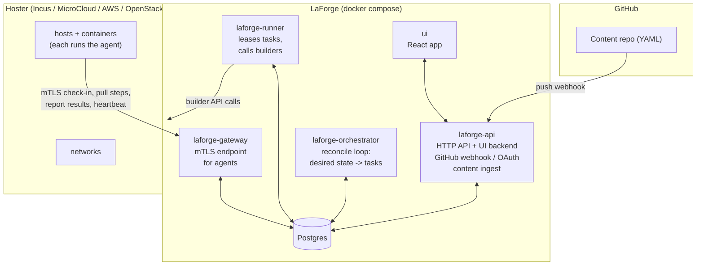
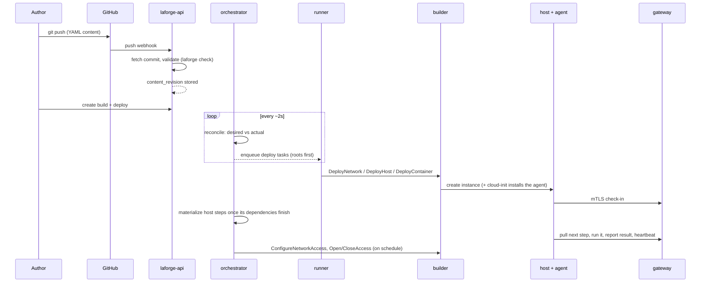
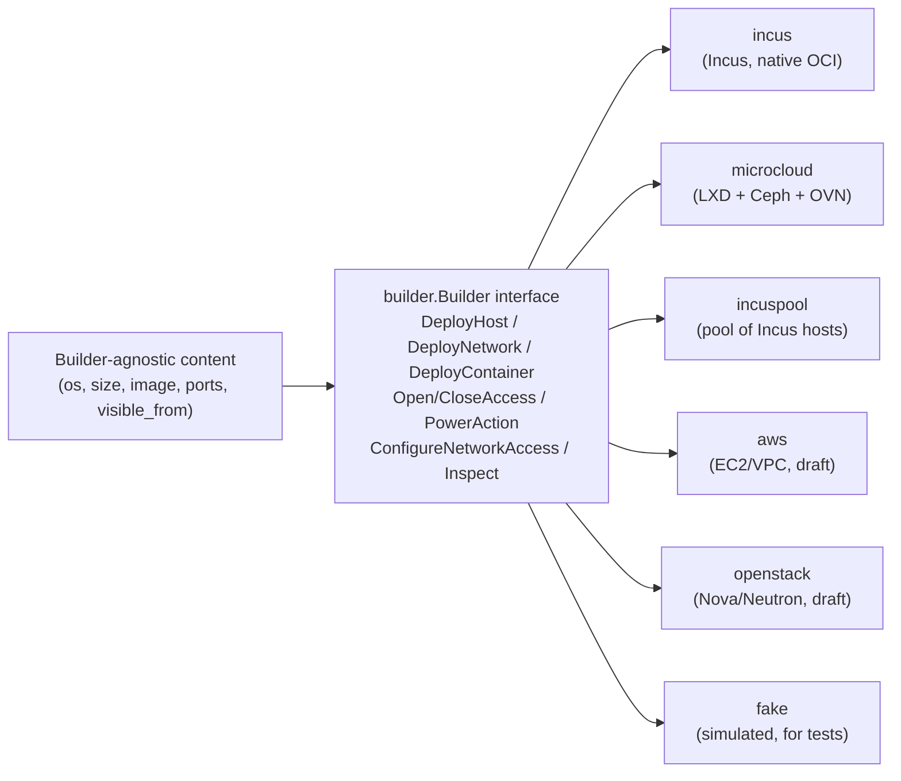

# LaForge

**Infrastructure-as-content for cyber competitions.** LaForge turns a plain-language
YAML description of a competition environment — networks, hosts, containers, the
software on them, and who can reach what — into real, running infrastructure on
whatever platform you have (a private Incus/LXD cluster, a public cloud, or a lab
machine), identically replicated for every team.

It is built for the [Collegiate Penetration Testing Competition](https://globalcptc.org)
(CPTC) and events like it, where dozens of teams each need an identical copy of a
realistic target environment, deployed reliably, opened and closed on a schedule,
and torn down cleanly afterward.

---

## What it does

- **Content lives in Git.** You describe an environment in YAML — the same way you'd
  describe application config — and commit it to a repository. A push builds and
  (optionally) deploys it. No clicking through a cloud console, no per-team copy-paste.
- **The same content runs anywhere.** Content never names a hoster, an image ID, or an
  IP pool. A *builder* maps abstract concepts (`os: ubuntu22`, `size: small`) to a
  specific platform's primitives, so the identical environment deploys on Incus,
  MicroCloud/LXD, AWS, or OpenStack.
- **Every team gets an identical, isolated copy.** You write the topology once; LaForge
  replicates it per team and keeps teams from reaching each other.
- **Hosts configure themselves.** Each deployed host runs a small agent that pulls its
  ordered setup steps (install software, create users, drop files, run scripts) and
  reports results — so "the environment is ready" is a real, observable state, not a
  hope.
- **Access is a schedule, not a firewall you babysit.** Competition access windows open
  and close on their own; per-network reachability and per-host firewalls are declared
  in content and enforced for you.

## How you use it

1. Write your environment as YAML in a Git repo (see **[CONFIGURATION.md](CONFIGURATION.md)**).
2. Connect the repo to LaForge (a GitHub App) and point a *configured build* at a branch,
   an environment file, and a builder.
3. Push. LaForge validates the content, builds it, and — on your go — deploys it for
   every team.
4. Watch it come up in the UI: per-host status, live logs, findings, and access controls.
5. Tear it down when the event ends.

Authoring is helped by a **VS Code extension** (`editors/vscode/`) that provides
schema-aware completion, hover docs, and live `laforge check` diagnostics as you type.

---

## Architecture

LaForge is a small set of Go services around a Postgres database, a React UI, and a
Rust agent that runs on the deployed hosts. The services are deliberately thin and
single-purpose.



### The services

| Service | Binary | Responsibility |
| --- | --- | --- |
| **API** | `laforge-api` | The HTTP API, the UI's backend, GitHub App webhooks and OAuth sign-in. Ingests and validates pushed content, creates builds, exposes everything the UI shows. |
| **Orchestrator** | `laforge-orchestrator` | The reconcile loop. On a timer it compares each live build's desired state to reality and enqueues tasks (deploy, destroy, open/close access, configure network access, dispatch scheduled work). Talks only to Postgres. |
| **Runner** | `laforge-runner` | Leases tasks and executes them by calling a *builder*. This is the only service that talks to a hoster. Deploys in parallel across a worker pool. |
| **Gateway** | `laforge-gateway` | The mutually-authenticated (mTLS) endpoint the on-host agents connect to. Hands each agent its next step, receives results, tracks heartbeats. Nothing else is exposed to the deployed hosts. |
| **UI** | (Vite dev server / static build) | The React operator console. |
| **Database** | Postgres | The single source of truth for content revisions, builds, deployed objects, tasks, events, and access state. |
| **Migrate** | `laforge-migrate` | Applies schema migrations (goose) on startup. |

### The deploy lifecycle



Ordering falls out of two simple mechanisms rather than a dependency engine:
deterministic resource names let any task be retried safely (create-or-adopt), and
`depends_on` holds a host's *steps* until the things it needs have finished
configuring. The box itself deploys ahead of time (roots first, so a dependency
is underway before its dependents), and only step execution waits -- a
workstation's domain-join runs once its domain controller is a working DC, not
merely a booted Windows box.

### Builders: one interface, many platforms

Content is builder-agnostic. Each builder implements a single Go interface
(`internal/builder.Builder`) that maps LaForge's abstract concepts to a platform.



There is no "capabilities" opt-out: every builder implements the whole contract for
real, so an environment can't silently behave differently on a different platform.
Writing a new builder is documented in **[docs/builder-authoring.md](docs/builder-authoring.md)**.

### The agent

A deployed host installs a small **Rust agent** on first boot (via cloud-init). The
agent carries its own identity, connects out to the gateway over mTLS, pulls its
ordered steps, runs them (installing packages, writing files, creating users, running
scripts, rebooting), and heartbeats. It's built as a static binary and cross-compiled
for Linux and Windows targets; a container gets the same agent as its supervising
entrypoint, so containers configure and report exactly like hosts. A container that runs
a Docker Compose project gets a machine of its own, and the agent on it starts the
project before running the container's steps.

---

## The content model

Everything an author writes is one of a few object types, each in its own directory of
the content repo:

```
your-content-repo/
  <environment>.yaml     # the game: teams, schedule, and the network topology
  networks/*.yaml        # a CIDR shared identically by every team
  hosts/*.yaml           # a VM: os, size, disk, ports, setup steps
  containers/*.yaml      # the same idea, deployed as a container: one image,
                         #   or a whole Docker Compose project (compose: app/compose.yaml)
  scripts/*.yaml         # a templated script + its source file
  people/*.csv           # rosters (users/accounts) referenced by hosts and scripts
  .laforgeignore         # optional: paths whose YAML isn't LaForge content
```

An **environment** wires them together: it declares how many teams there are, the
access schedule, and — in its `networks:` topology — which hosts and containers sit on
which networks, how many copies, and at which addresses. Hosts and scripts are reusable
across environments; the environment is the only place they're connected.

A container can run a single image or a **Docker Compose project** kept next to it in the
repo — the same compose file developers run locally, deployed on one machine with one
address. Every `.yaml` in the repo is read as LaForge content, so a compose project's
directory (or any other tool's YAML) is listed in **`.laforgeignore`**, which
`laforge check`, the server, and the editor all honor.

Builder setup and the permissions LaForge needs on your hoster are in
**[docs/builders/](docs/builders/)** ([Incus](docs/builders/incus.md),
[MicroCloud](docs/builders/microcloud.md)).

See **[CONFIGURATION.md](CONFIGURATION.md)** for the full YAML reference, with worked
examples from a one-host environment to a complete multi-network game.

---

## Getting started

**[USAGE.md](USAGE.md)** covers the whole setup:

- building and running the stack with Docker Compose,
- the `.env` file and generating dev certificates,
- registering and installing the GitHub App that connects your repos,
- and building, packaging, and installing the VS Code authoring extension.

## Repository layout

```
cmd/            entrypoints for each service + the laforge CLI and LSP
internal/       the implementation, one package per concern:
  api           HTTP API, UI backend, webhooks, OAuth
  orchestrator  reconcile loop, scheduling, access enforcement
  runner        task execution against builders
  gateway       mTLS agent endpoint
  builder/*     the Builder interface and each platform's implementation
  loader        parse + validate content (the laforge check engine)
  render        per-host/per-team template rendering
  ingest        persist a validated content revision
  schedule      natural-language schedule grammar
  schema        the JSON Schemas content is validated against
  db            sqlc-generated database access
  ...
agent/          the Rust on-host agent
ui/             the React operator console
editors/vscode/ the VS Code authoring extension
migrations/     goose database migrations
examples/       example content repositories
docs/           builder-authoring guide
```

## License

See the repository's license file. LaForge is developed for and by the CPTC community.
