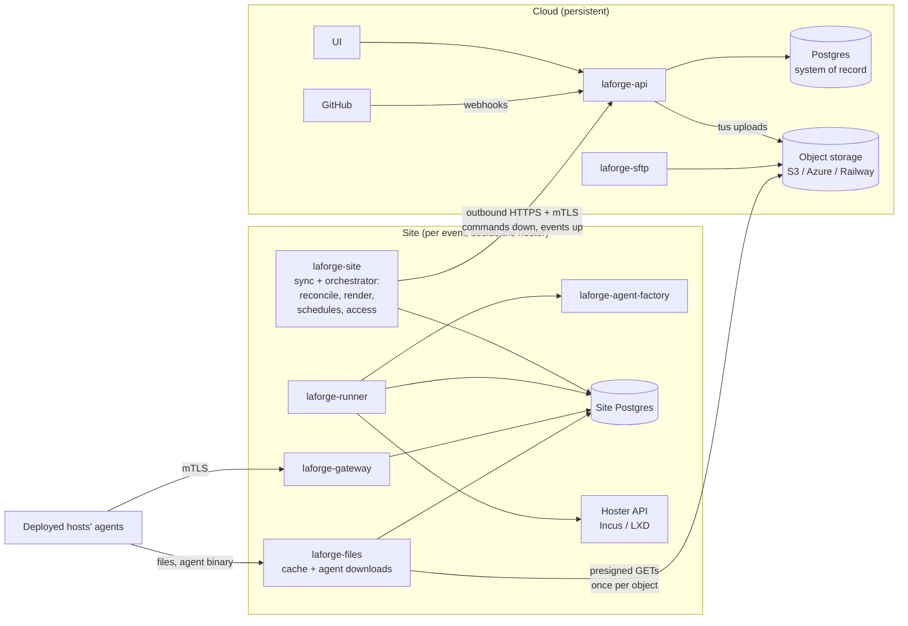

# Plan: cloud control plane, on-site execution, and a file store

**Status:** proposal, not scheduled. Nothing here is implemented.
**Written:** 2026-10-08, against branch `3.0` at `fef451b5` (plus the then-uncommitted
compose, builder-docs and GitHub-connection work). Re-check the inventory in §2 against
the code before starting; it was taken by reading the code, not by tracing a live system.

The goal: run LaForge's primary services in the cloud permanently, year over year, and
run everything that touches the competition infrastructure — builders, the agent
gateway, agent and file delivery — as a separate set of containers on-site, next to the
hoster. The two talk over an API (not a shared database). Alongside it, add a file store
whose source of truth is cloud object storage, replicated down to each site so that
large files cross the internet once.

---

## Contents

1. [Goals and non-goals](#1-goals-and-non-goals)
2. [How LaForge is coupled today](#2-how-laforge-is-coupled-today)
3. [Target architecture](#3-target-architecture)
4. [Who owns what data](#4-who-owns-what-data)
5. [The site protocol](#5-the-site-protocol)
6. [Changes per component](#6-changes-per-component)
7. [Database changes](#7-database-changes)
8. [Security model](#8-security-model)
9. [The file store](#9-the-file-store)
10. [UI and CLI changes](#10-ui-and-cli-changes)
11. [Phases](#11-phases)
12. [Open decisions](#12-open-decisions)
13. [Risks](#13-risks)

---

## 1. Goals and non-goals

**Goals**

- One small, long-lived cloud deployment holds everything worth keeping between events:
  accounts and access, repositories and content history, builds, findings, reports,
  files.
- One or more **sites**, each a disposable container stack beside a hoster, do all the
  infrastructure work: builder calls, agents, files, images.
- **The site keeps the competition running when the internet doesn't.** Agents keep
  checking in and running steps, schedules and access windows fire on time, and results
  are kept and sent up when the link returns.
- **The site only connects outbound.** It needs no inbound port from the internet.
- **Hoster credentials never leave the site.**
- **The heavy work runs on the site:** reconciling builds, rendering every host's steps
  for every team, fingerprinting, builder calls, agent building, image builds, file
  delivery. The cloud does policy, validation and record-keeping.
- **Large files cross the internet once per site**, not once per host per team.
- One cloud can serve several sites (several events, venues or hosters) — one per
  builder.

**Non-goals**

- A hot-standby or multi-region cloud. The cloud being down blocks *changes* (new builds,
  new content, uploads); it must not stop a running competition.
- Running content from more than one site in the same build. A build is placed on exactly
  one site.
- Replacing the agent protocol. Agents keep talking mTLS to a gateway; that gateway just
  moves to the site.

---

## 2. How LaForge is coupled today

Every service shares one Postgres and coordinates through it. There is no
service-to-service API, except the api reaching the gateway's shell relay directly
(`gateway:8445`, `internal/api/terminal.go`).

| Service | Does | Database use (from `internal/<pkg>`) |
| --- | --- | --- |
| `laforge-api` | UI and CLI API, GitHub webhooks and sign-in, live events (Postgres `LISTEN laforge_event`), serves agent binaries and artifacts | Everything; it is the read side of every screen. |
| `laforge-orchestrator` | Reconciles builds against content, materializes steps once dependencies finish, dispatches schedules, opens and closes access windows, polls instance power state, runs docker base image builds, cleans up | `CreateTeamTask`, `CreateTaskIfNoneOpen`, `CreateAgentTask`, `NextStepIndexForHost`, `MarkDeployedObject*`, `SetDeployedObject*`, `ListDueScheduledTasks`, `MarkScheduledTaskFired`, `RescheduleScheduledTask`, `SetTeamAccessState`, `ClearTeamAccessOverride`, `Has*Task`, `StartImageBuild`/`Finish*`, `ListAgentSessionsByBuild`, `SummarizeAgentTasksByObjectForBuild`, and the content reads behind reconcile. |
| `laforge-runner` | Leases tasks and makes builder calls; builds per-object agent binaries | `LeaseTask*`, `HeartbeatTask`, `CompleteTask`, `FailTask`, `RetryTask`, `MarkDeployedObject*`, `SetDeployedObjectExternalRef`, `DeleteDeployedObject`, `CreateAgentArtifact`, `UpsertExternalAccess`, `DeleteExternalAccessForObject`, `GetBuilderConfigByName`, `GetRegistryCredentialByHost`, `SetTeamAccessState`, `CreateEvent`. |
| `laforge-gateway` | Agent mTLS, next command, results, heartbeats, shell relay | `NextAgentTaskForHost`, `GetAgentTask`, `CompleteAgentTask`, `FailAgentTask`, `RecordValidatorResult`, `CreateAgentStepEvent`, `CreateAgentHeartbeat`, `UpsertAgentSession`, `GetBuildIDByDeployedObject`. Runs as the restricted `laforge_gateway` role. |
| `laforge-agent-factory` | Patches the agent binary per object | Called by the runner (`internal/agentdelivery`); no tables of its own. |

The orchestrator's loop (`cmd/laforge-orchestrator/main.go`) runs separate tickers:
reconcile, heartbeat cleanup, schedule dispatch, access windows, instance-state polling,
checkout cleanup, and image builds. That split matters below, because they don't all go
to the same side.

Content reaches services as a git checkout (`internal/checkout`): the orchestrator,
runner and api each render scripts and steps from the repo on disk.

---

## 3. Target architecture



**Cloud:** UI, api (which already does push validation, revision tracking and creating
builds), Postgres as the system of record, object storage, and an SFTP front door for
files. No orchestrator, runner or gateway.

**Site:** a new `laforge-site` service — the only thing that talks to the cloud, and the
home of today's orchestrator — plus the existing runner, gateway and agent factory, a new
`laforge-files` cache, and a small Postgres of its own. Everything on-site talks to the
site database exactly as it talks to the shared one today, so most of their code changes
very little.

**The policy/execution line.** The cloud decides *what* should happen: which content
revision a build follows, when it is built and deployed, who approved it, whether a
commit passed validation. The site works out *how* and does it: it receives the content
itself, reconciles the build against it, renders every host's steps, computes
fingerprints and drift, makes the builder calls, and fires schedules and access windows
on its own clock. That puts all the computationally heavy work — rendering scales with
teams × hosts × scripts — on the site, next to the hoster, and lets most of today's
orchestrator code move there unchanged.

The cloud ships the site two things: **content bundles** (a content revision as a
content-addressed archive, sent once per revision), and **desired build state** (this
build follows revision R, is deploying or torn down, has these overrides). The site
carries it out without asking the cloud anything.

---

## 4. Who owns what data

| Data | Owner | Flows |
| --- | --- | --- |
| Accounts, sessions, repository access, instance admins | Cloud | Never leaves. |
| Repositories, configured builds, push validation results | Cloud | Never leaves. |
| Content revisions | Cloud | Down as a content bundle, once per revision a site's builds use. The site ingests it into its own database. |
| Builds (desired state, approvals) | Cloud | Down; the site reports progress up. |
| Deployed objects, fingerprints, upcoming changes | Site | Computed on-site from the content; up as events and summaries the UI shows. |
| Deployed objects (actual: external ref, status, power state) | Site | Up, as events. |
| Tasks (deploy, destroy, network and external access, power) | Site | Created on-site by the orchestrator; results up. |
| Agent tasks (commands), step events, validator results | Site | Rendered on-site; results up. |
| Agent heartbeats and metrics | Site | Kept on-site at full resolution; up as rolled-up summaries. |
| Scheduled tasks, access windows | Site | Derived on-site from the content; firings up. Late changes (an admin overriding a window) go down as commands. |
| Events journal | Both | Site events go up and are appended to the cloud journal, which the UI reads. |
| Builder configs (images, sizes, settings) | Cloud | Down. |
| Builder credentials (hoster client certs and keys) | **Site** | Never up. The cloud stores only "site X has credential for builder Y, fingerprint Z". |
| Registry credentials | Site (set from the UI, delivered once over the protocol) | Down once, encrypted to the site's key; never read back. |
| Agent binaries and per-object artifacts | Site | Never up. |
| Files (objects) | Cloud object storage | Down to each site that needs them. |
| Files uploaded by agents (`upload` step) | Site, then cloud | Up, asynchronously. |
| Findings, reports | Cloud | Built from events sent up. |

---

## 5. The site protocol

### 5.1 Transport and identity

- The site opens one long-lived **WebSocket** (or HTTP/2 stream) to the api over HTTPS,
  authenticated with a **site client certificate**, falling back to long-polling where a
  proxy breaks WebSockets. JSON messages, matching the rest of the codebase.
- **Enrollment** is automatic on first start, from an environment file the cloud
  generates in the builder wizard — there is no command to run on the site. See
  [§5.6](#56-standing-up-a-site-and-its-builder). Revoking a site in the UI invalidates
  its certificate.
- Every message carries a **protocol version**; the cloud refuses a site it can't speak
  to with a clear error, and the site reports its version in the UI.

### 5.2 Reliability

- **Both directions are at-least-once, with idempotency.** Every message has a
  monotonically increasing sequence number per direction and an idempotency key. Each
  side records the last sequence it applied; replays are no-ops.
- **Outboxes on both sides.** The cloud writes commands to a `site_outbox` table in the
  same transaction as the change that caused them; the site writes events to its own
  outbox in the same transaction as its state change. A sender drains its outbox and
  deletes acknowledged rows. Nothing is lost when either side restarts or the link drops.
- **Back-pressure.** Heartbeat summaries and logs are sent at lower priority than task
  results and state changes, and are dropped first (with a counted gap) if the backlog
  grows past a limit.

### 5.3 Messages down (cloud → site)

| Message | Contents |
| --- | --- |
| `content.bundle` | A content revision: id, SHA-256, size, and where to fetch the archive. Sent before any build that uses it; the archive itself travels like a file (§9.5), once per site. |
| `build.desired` | A build's desired state: which revision and environment it follows, its configured-build settings, whether it should be deployed or torn down, team count, auto-deploy policy, access and schedule overrides. Versioned; the site reconciles to the latest version it has. |
| `build.command` | Imperative actions: deploy pending changes now, tear down, rebuild an object, power on/off/reboot, open/close a team's access early, run an ad-hoc task (the authored step; the site renders it), dismiss. |
| `builder.config` | Images, sizes and settings for this site's builder. Credentials are created on-site (§8). |
| `registry.credential` | A registry login, encrypted to the site's public key. |
| `files.manifest` | Files an admin pinned to this site. The site works out the rest from its content bundles, and requests presigned download URLs for what it lacks. |
| `shell.open` | Open an interactive shell on an object; carries the relay session (§6.1). |
| `site.config` | Site-level settings: addresses agents use, log forwarding, retention. |

### 5.4 Messages up (site → cloud)

| Message | Contents |
| --- | --- |
| `object.state` | Status transitions, external ref, power state, fingerprint, last error. |
| `build.upcoming` | What deploying the build's latest revision would change (today's Upcoming Changes panel), computed on-site. |
| `task.result` | Builder task outcome, with error. |
| `agent.result` | Agent command outcome, output (truncated, with the full text kept on-site and fetchable on demand), validator results. |
| `agent.session` | Agent connected/disconnected, version. |
| `heartbeat.summary` | Per object per minute: last seen, CPU/memory/disk/network rollups. |
| `schedule.fired` / `access.changed` | What fired when, and its result. |
| `event` | Anything the build's journal shows. |
| `files.status` | Per-file replication state on this site. |
| `upload.available` | An agent uploaded a file; it is on-site and being sent up. |
| `site.health` | Versions, disk, hoster reachability, backlog sizes, clock offset. |

### 5.5 Running disconnected

- The site's orchestrator fires schedules and access windows from its own copy of the content and desired state, on its own clock. Its clock
  must be right: the site checks NTP and reports its offset; the UI warns when it drifts.
- Everything the site does while disconnected sits in its outbox and is sent in order on
  reconnect. The cloud applies it as history, not as new instructions.
- Commands queued in the cloud while the site is away (an admin closing access early)
  wait in the cloud outbox. The UI shows each one as **pending delivery** until
  acknowledged, so nobody believes a door is closed when it isn't.
- The UI shows each site's **last contact** and a banner on every build placed on a site
  it hasn't heard from recently.

---

### 5.6 Standing up a site and its builder

**A site and a builder are one-to-one.** Every site exists to run exactly one builder
(for Incus, that one builder can still be a pool of several hosts), and every builder
needs a site next to its hoster. So there is no separate "add a site" workflow: the
**builder wizard creates the site as its first step**, and a build runs on whatever site
its builder belongs to.

The order is still **site, then builder**, because the site is the one piece LaForge
doesn't deploy — the cloud never connects into a venue's network — and the builder can't
be connected until the site is running beside the hoster. The wizard walks through that
order instead of leaving it to the operator.

**Where the site runs:** any Linux machine with Docker that can reach the hoster's API and
that deployed hosts can reach. Recommended: a small VM or system container on the hoster,
created by hand and not managed by LaForge, so tearing down builds never touches it.
Avoid running it on an Incus host itself — Docker there rewrites the firewall's
forwarding rules and can break Incus networking.

**The wizard** (**Admin → Infrastructure → New builder**):

1. **Site.** Name it (for example `cptc12-venue`). LaForge creates the site record and a
   one-time enrollment token (expires in 24 hours by default) and offers
   `laforge-site.env` to download:

   ```bash
   # laforge-site.env -- generated by LaForge for site "cptc12-venue"
   LAFORGE_CLOUD_URL=https://laforge.example.com
   LAFORGE_CLOUD_CA_SHA256=3f9a…            # pins the cloud's certificate
   LAFORGE_SITE_NAME=cptc12-venue
   LAFORGE_SITE_ENROLL_TOKEN=lfsite_…       # one-time; harmless once redeemed
   ```

   On the site machine, put it next to `docker-compose.site.yml` (which reads it with
   `env_file:`) and start the stack:

   ```bash
   docker compose -f docker-compose.site.yml up -d
   ```

   On first start `laforge-site` finds no identity in its `site-identity` volume, so it
   generates a keypair locally, redeems the token with a certificate signing request,
   pins the cloud's certificate, and stores its signed certificate in the volume. The
   wizard shows the site's state live — waiting, connected, or why enrollment failed
   (expired token, certificate pin mismatch) — and moves on once it connects.

   This step also asks for the site's agent-facing addresses (the gateway address and
   file URL deployed hosts use), which only the operator knows. They are sent down as
   `site.config`, and can be changed later.

2. **Type** — Incus, MicroCloud, AWS, OpenStack, as today.

3. **Connect.** The admin pastes the hoster's trust token (one per host for an Incus
   pool). The cloud sends it to the site in a `builder.connect` command and does not
   store it. The site enrolls with the hoster, keeps the generated client key in its own
   credential store, and replies with what it discovered: storage pools, networks,
   images, the server's fingerprint. Cloud builders (AWS, OpenStack) send their API
   credentials down the same way, encrypted to the site's key.

4. **Placement, Images, Sizes, Review** — as today, from what the site discovered. Saving
   stores the configuration in the cloud and sends it down as `builder.config`; the base
   image build is a command to the site, with its log streamed back to the same console.

Standing a site up takes real time (provisioning a machine, pulling images), so the
wizard is **resumable**: leaving it after step 1 keeps a draft builder whose site is
waiting to connect, and reopening it picks up where it stopped. A draft whose site never
connects can be deleted, which also invalidates its token.

**After setup:**

- The token is spent. Restarts use the stored identity and ignore the token, so the env
  file can stay where it is.
- Rediscover, credential rotation, and changing the builder's settings go through the
  site as above, and need it connected.
- **Moving a builder to a new machine** (a rebuilt site box): download a fresh env file
  from the builder's page and start the stack with an empty `site-identity` volume. The
  site re-enrolls as the same site; hoster credentials, which lived on the old machine,
  are re-connected from the builder page.
- **Deleting a builder** deletes its site: the site's certificate is revoked and it is
  told to discard its credentials. A builder with live builds can't be deleted.

**When a hoster's trust token mustn't pass through the cloud at all:** drop it into the
site's `builder-tokens/` directory instead of pasting it in step 3. The site enrolls it on
start, deletes the file, and the wizard continues from what it discovered.

## 6. Changes per component

### 6.1 `laforge-api` (cloud)

- Endpoints that act on infrastructure (deploy, tear down, power, ad-hoc tasks, access
  overrides) write a `build.command` to the site outbox instead of creating `task` rows.
- Push validation (`laforge check` on every commit, which renders every script for every
  host in every team) stays in the api: it has to happen whether or not any site is
  connected, and it feeds GitHub's commit status. It is the one heavy job left in the
  cloud; see §12.
- Creating builds and auto-deploy (`triggerBuild`, `applyUpcoming` in `webhook.go`) stay
  in the api, but end in a `build.desired` update and, for content a site hasn't seen, a
  `content.bundle`.
- Read endpoints (build detail, hosts, logs, findings, access) read the cloud tables the
  site's events keep up to date. Live views keep using `LISTEN laforge_event`; inserting
  a site event fires it as today.
- **Shells:** the browser's WebSocket stays on the api. The api sends `shell.open`; the
  site dials the gateway's relay locally and opens a second stream to the api tagged with
  the session id; the api splices the two. Bytes go browser ↔ cloud ↔ site ↔ agent. If
  operators can reach the site directly, a later option is to send the browser straight
  to a site-side relay with a short-lived ticket.
- **Agent binaries and artifacts** are no longer served by the api. `API_PUBLIC_URL`
  becomes the site's file service (§9.6).
- New: site enrollment and management, the site protocol endpoint, the file store
  endpoints (§9).

### 6.2 The orchestrator moves to the site

`laforge-orchestrator` runs inside the site stack (as part of `laforge-site`, or as its
own container beside it), against the site database. Every ticker moves with it:

| Today's ticker / job | Goes to | Notes |
| --- | --- | --- |
| Reconcile (content → desired objects, fingerprints, drift) | Site | Driven by `build.desired` and the ingested content bundle instead of reading the shared database. |
| Step materialization (`materialize_steps.go`) | Site | Unchanged: renders each object's steps from the content checkout just before releasing them, once dependencies finish. |
| Schedule dispatch | Site | Unchanged. |
| Access windows (open/close) | Site | Unchanged; overrides arrive as commands. |
| Instance-state polling | Site | Results up as `object.state`. |
| Heartbeat cleanup | Site | Cloud keeps only summaries. |
| Checkout cleanup | Site | Content bundles are unpacked into the site's checkout cache. |
| Docker base image builds | Site | Triggered by a command; log streamed up as events. |
| Network and external access configuration | Site | Unchanged. |

Because rendering still happens where and when it does today, script behaviour doesn't
change. What changes is the orchestrator's inputs (desired state and content arrive over
the protocol, not from the shared database) and its outputs (state changes also go into
the site outbox).

**Content on the site.** The site's `checkout` cache is filled from content bundles
instead of `git clone`, and `internal/ingest` loads each bundle into the site database,
as the api does today on a push. The site never needs GitHub access or credentials.

**Same version on both sides.** The cloud validated the content with its own renderer;
the site renders it again with its own. Each `build.desired` names the LaForge version
the cloud validated with. A site on a different version re-validates the bundle before
deploying and refuses the build, with the reason, if its result differs.

### 6.3 `laforge-runner` (site)

- Reads builder configs from the site database (written by the site service from
  `builder.config`) and credentials from the site's credential store.
- Leases the same `task` rows, created by the orchestrator on-site as today.
- Reports through the site database; the site service turns changes into events.
- Loads content from the site's checkout cache (filled from content bundles), exactly as
  it loads it today.

### 6.4 `laforge-gateway` (site)

- Essentially unchanged: it already uses the restricted `laforge_gateway` role and only
  agent tables. Point it at the site database.
- `GATEWAY_PUBLIC_ADDR` becomes a site address, which is the point: agents reach it
  across the local network.

### 6.5 `laforge-agent-factory` (site)

Unchanged, moved on-site. The per-object agent embeds the site's gateway address and CA.

### 6.6 Content checkouts

The api still checks out content for push validation and the UI's content views. Sites
get content as bundles (§6.2), never from GitHub. A site holds only the revisions its
builds use, and drops them with the build.

### 6.7 Deployment

- A new `docker-compose.site.yml` (and image) for the site stack: `laforge-site`,
  `laforge-runner`, `laforge-gateway`, `laforge-agent-factory`, `laforge-files`,
  Postgres, migrations. It reads `laforge-site.env` (§5.6) and keeps the site's identity
  in a `site-identity` volume and hoster credentials in a `site-credentials` volume.
- The cloud compose drops the runner, gateway and agent factory, and gains the planner
  and SFTP.
- A single-box mode (cloud and site in one compose, talking over loopback) for
  development and for small events, so there is one code path, not two.

---

## 7. Database changes

### 7.1 Cloud

- `site` — id, name, certificate fingerprint, status, last contact, versions, clock
  offset.
- `site_enrollment` — one-time tokens.
- `site_outbox` and `site_inbox_cursor` — the command outbox and the last sequence
  applied from each site.
- `builder_config.site_id`, unique and required: one site per builder. A build's site is
  its builder's, so builds don't need a site column of their own (keep a denormalized
  `build.site_id` only if queries need it). Keeping `site` a separate table, rather than
  folding its columns into `builder_config`, keeps identity and connection state apart
  from configuration, and would let the one-to-one rule be relaxed later.
- `builder_credential` becomes `builder_credential_ref` — fingerprint and site only.
- Heartbeats become per-minute summaries; the raw `agent_heartbeat` table stays site-only.
- File store tables (§9.3).

### 7.2 Site

A subset of today's schema — `task`, `deployed_object`, `team`, `agent_task`,
`agent_session`, `agent_heartbeat`, `agent_step_event`, `validator_result`,
`scheduled_task`, `agent_artifact`, `external_access`, `shell_session`, the build-side
tables the orchestrator reads, and the content tables `internal/ingest` writes (only for
revisions its builds use) — plus `build_desired_version`, `site_outbox`,
`cloud_inbox_cursor`, the local credential store, and the file cache index (§9.5).

Keep one migration history with two targets (cloud and site), and generate separate sqlc
query packages per side, so a site component can't accidentally query a cloud-only table.

---

## 8. Security model

- **Outbound only.** The site dials the cloud; the cloud never connects to the site.
- **Site identity:** a certificate signed by the cloud at enrollment, revocable from the
  UI. All site traffic is mTLS.
- **Scope:** a site only receives builds placed on it and files in its manifest, and can
  only report on objects of builds placed on it. The cloud checks every inbound event
  against that.
- **Hoster credentials stay on-site.** A builder's trust token is forwarded to the site in
  a `builder.connect` command and discarded by the cloud, or dropped into the site's
  `builder-tokens/` directory and never seen by the cloud ([§5.6](#56-standing-up-a-site-and-its-builder)).
  Either way the client key is generated and kept on-site only. The token is single-use
  and short-lived; a compromised cloud could intercept one, but it could already instruct
  the site to do anything, since it is the control plane.
- **Site enrollment token:** single-use, expiring, and only good for the site record it
  was issued for. The env file pins the cloud's certificate, so a site can't be enrolled
  into an impostor.
- **Registry credentials** are encrypted to the site's public key before they leave the
  cloud.
- **Blast radius:** a compromised cloud can send malicious plans and commands to sites
  (it is the control plane), but cannot read hoster credentials. A compromised site can
  only affect its own builds' records.
- **Content is on the site.** A site holds full content bundles for its builds, including
  people CSVs, vars and anything else secret in the repository — the same material its
  rendered commands contain anyway. Bundles cross the internet inside the mTLS channel (or
  as presigned downloads of the content-addressed archive), and are dropped with the
  build.

---

## 9. The file store

### 9.1 What it is for

A place to keep files that content uses — installers, tool archives, disk images,
datasets, wordlists, Compose project assets — from a few KB to several GB. Uploaded once
through the UI, CLI or SFTP; managed in the UI; referenced from scripts and steps by
name; delivered to hosts from the site, so each file crosses the internet once per site.
It also finally gives the existing `upload` step (today "not implemented — no file store
yet") somewhere to put things.

### 9.2 Storage backends

The cloud's object storage is the source of truth. Use one blob abstraction —
[`gocloud.dev/blob`](https://gocloud.dev/howto/blob/) covers S3, Azure Blob, GCS and a
local directory — so the backend is configuration:

| Backend | Covers |
| --- | --- |
| S3-compatible | AWS S3, Railway buckets (S3-compatible), Cloudflare R2, Backblaze B2, MinIO |
| Azure Blob Storage | Azure |
| Local directory | Development, single-box mode |

Configuration: `FILESTORE_URL` (for example `s3://bucket?region=…&endpoint=…`,
`azblob://container`, `file:///var/lib/laforge/files`), plus the provider's usual
credential environment variables.

Objects are stored by content: key `sha256/<first2>/<sha256>`. Names live in the
database. Renames are free, identical uploads are stored once, and a site can verify
everything it fetches.

### 9.3 Data model (cloud)

- `file` — id, **scope** (`global`, or a repository id), **path** (unique within its
  scope, e.g. `tools/nmap-7.95.tgz`), current version, description, tags, created/updated
  by and at, deleted-at (soft delete).
- `file_version` — file id, version number, sha256, size, content type, uploaded by, at.
  Uploading to an existing path adds a version; the newest is current. Keep the last *N*
  versions (setting), and any version a live build's content still references.
- `file_blob` — sha256, size, storage key, reference count. Garbage-collected when nothing
  references it.
- `file_upload` — in-progress resumable uploads: id, target scope/path, expected size,
  offset, backend multipart id, expires-at.
- `file_site` — per site per blob: wanted / fetching / present / failed, bytes, last
  error.
- Events for every upload, rename, delete and restore, in an audit list per file.

Permissions: instance admins manage `global`; a repository's `manage` level and above
manages its scope; anyone who can read a repository can see and download its scope's
files and `global` ones.

### 9.4 Uploads

**Resumable over HTTP — tus.** Use the [tus](https://tus.io) resumable upload protocol
(the `tusd` Go library, mounted inside the api), which already has S3 and Azure storage
backends that stream into a multipart upload, so the api never holds a whole file:

- The upload is created with its target path and size; data is sent in chunks; an
  interrupted upload is resumed from the last acknowledged offset by `HEAD`-ing it.
- A SHA-256 is computed as data arrives and checked against the client's when the upload
  completes; only then does a `file_version` appear.
- Abandoned uploads expire and their multipart parts are aborted.
- **UI:** a drag-and-drop uploader (`tus-js-client`, or Uppy) with progress, pause and
  resume, which survives a page reload.
- **CLI:** `laforge files put` speaks tus too, keeping each upload's URL and offset in
  `~/.config/laforge/uploads/`, so re-running the same command resumes.

> If proxying several-GB uploads through the cloud server ever costs too much bandwidth,
> switch S3 and Azure to **direct-to-bucket** uploads: the api hands out presigned
> multipart part URLs (S3) or SAS block URLs (Azure) and only records completion. Same
> CLI and UI commands; a later optimization, not a different design.

**SFTP — `laforge-sftp`.** A small cloud service on `golang.org/x/crypto/ssh` and
`github.com/pkg/sftp`, exposing the file store as a filesystem: `/global/…`,
`/repos/<owner>/<repo>/…`.

- **Authentication:** the user's GitHub SSH public keys (`https://github.com/<login>.keys`),
  for accounts that already exist in LaForge, cached and refreshed. The same permissions
  as the UI apply.
- **Writes** stream into the same multipart pipeline as tus. SFTP clients resume with
  `reput`/`reget`, which sends an offset; the service maps that onto the in-progress
  upload.
- **Reads** stream from object storage (range reads). Directory listing, rename, delete
  and mkdir map onto file records.
- **Ports:** 2022 by default, on its own hostname. (`cptcvm01` already runs an unrelated
  SFTP container on 2222, if the cloud ever shares a host with one.)

### 9.5 Replication to a site — `laforge-files`

A new container on each site, with its own volume.

- **What a site holds** is the union of: every file version referenced by the content of
  a build on the site (the site's orchestrator works this out when it ingests a content
  bundle, and asks the cloud for presigned URLs), files an admin **pins** to the site
  (sent as `files.manifest`), and anything recently fetched on demand. The cloud computes
  the same references during push validation, for the Files page's "used by".
- **Prefetch:** when a manifest arrives, `laforge-files` downloads every missing blob
  through a short-lived presigned GET from the cloud, in parallel, with HTTP range
  requests so an interrupted multi-GB download resumes. It verifies the SHA-256 before
  making the blob available. Progress goes up as `files.status`, so the UI shows "4 of 5
  sites have this file" and a build page warns when a file it needs isn't on its site yet.
- **Read-through:** a request for a blob the site doesn't have yet (a late content
  change) fetches it while streaming it to the requester.
- **Eviction:** least-recently-used beyond a size cap, never evicting a blob referenced by
  an active build or pinned.
- **Egress:** each blob leaves the cloud once per site, plus re-fetches after eviction.
  Everything hosts download is served on the site's local network.
- **Offline:** what is present keeps being served when the cloud is unreachable; only new
  files wait.

### 9.6 Delivery to hosts, and templates

`laforge-files` serves `https://<site-files-address>/f/<token>`, reachable from team
networks, with range support for resumable downloads. It also takes over serving agent
binaries (`API_PUBLIC_URL`).

- **Tokens** are minted per build, per file version, signed with a site key, and expire
  with the build. A token only grants that one file. Anyone who can read the box's steps
  can read its URLs — the files are meant for that box anyway.

In content:

```yaml
steps:
  - download: { file: tools/nmap-7.95.tgz, to: /opt/nmap.tgz }   # new: by file store path
  - extract: { src: /opt/nmap.tgz, dest: /opt/nmap }
  - script: install-tool
```

```bash
# scripts/install-tool.sh -- template functions
curl -fsSLo /tmp/wordlist.txt '{{ file "wordlists/rockyou.txt" }}'
echo '{{ fileSHA256 "wordlists/rockyou.txt" }}  /tmp/wordlist.txt' | sha256sum -c -
```

- `{{ file "path" }}` → the site URL for the file's current version (or
  `{{ file "path@3" }}` for version 3). A path resolves in the repository's own scope
  first, then `global`.
- `{{ fileSHA256 "path" }}`, `{{ fileSize "path" }}` for verification.
- `download: { file: … }` is sugar for the URL form, and the agent verifies the SHA-256
  after downloading.
- **Fingerprints:** a file's SHA-256 is part of every referencing object's fingerprint
  (`orchestrator.Fingerprint`), so replacing a file redeploys the hosts that use it — the
  same rule as editing a script today. Pinning `@version` opts out.
- **`laforge check`:** offline, it checks the syntax of every reference; with `--online`
  (or in the server's own validation) it checks that every referenced file exists, and
  fails a build that names a missing one.
- **Compose projects** may reference file store objects for anything too large for the
  1 MiB project directory, by downloading them in an earlier step.

### 9.7 The `upload` step (agent → file store)

`upload: { from: /var/log/app.log, to: evidence/{{ .host.hostname }}/app.log }` — the
agent streams the file to `laforge-files` (mTLS, its own identity), which stores it
on-site and replicates it up asynchronously into the repository's scope. It appears in
the UI under the build. This closes the long-standing gap noted in
`internal/gateway/steps.go`.

### 9.8 Operations

- **Quotas:** per scope total and per file maximum; uploads over quota fail up front.
- **Retention:** soft-deleted files are purged after a grace period (setting), then their
  blobs are garbage-collected when unreferenced.
- **Lifecycle:** the bucket itself should have no lifecycle rules that delete objects —
  LaForge's garbage collector owns deletion.
- **Cost visibility:** the Files page shows bytes stored per scope, and bytes sent to each
  site.

---

## 10. UI and CLI changes

**UI**

- **Builder wizard** gains a first **Site** step (env file download, live enrollment
  state, agent-facing addresses) and becomes resumable; connecting goes through the site
  (§5.6). There is no separate Sites page.
- **Builder page** gains the site's health: status, last contact, versions, clock
  offset, backlog, disk; edit its addresses; download a fresh env file; re-enroll.
- **Builds:** the site they're placed on; a disconnected-site banner; commands shown as
  *pending delivery* until acknowledged.
- **Files:** browse by scope and folder; upload (resumable, drag-and-drop); download;
  rename and move; delete and restore; versions with restore; "used by" (which content
  references it); replication status per site; pin to a site; quota and usage.

**CLI** (`laforge files …`)

| Command | Does |
| --- | --- |
| `ls [scope:]path` | List, with sizes, versions, SHA-256s. |
| `put <local> [scope:]path` | Resumable upload; re-running resumes; `--parallel N` chunks. |
| `get [scope:]path[@version] <local>` | Download, resumable, verified. |
| `rm`, `mv`, `restore`, `versions` | Management. |
| `stat` | Versions, references, per-site status. |
| `pin <path> --site <site>` | Keep it on a site. |

**CLI:** `laforge builders` gains each builder's site status, and `laforge builders env
<name>` downloads a fresh env file. Nothing is run on the site itself; it enrolls from
its env file (§5.6).

---

## 11. Phases

Each phase ships and is usable on its own.

1. **File store in the cloud, single box.** Tables, `gocloud.dev/blob` backends, tus
   uploads in api, UI Files page, `laforge files` CLI, template functions and
   `download: { file: … }`, fingerprints, `check --online`. Delivered from the api for
   now. *Exit:* a multi-GB file uploaded with an interrupted-and-resumed CLI upload is
   downloaded and verified by a host via a template.
2. **SFTP.** `laforge-sftp` with GitHub-key auth and resume. *Exit:* `reput` of an
   interrupted multi-GB upload completes and matches its SHA-256.
3. **Desired state and content bundles, still single box.** The api stops creating
   `task` rows and instead writes `build.desired` and `content.bundle`; the orchestrator
   reconciles from them and from bundles it unpacks itself, still in one database. *Exit:*
   a full competition build (networks, Windows and Linux hosts, compose containers,
   schedules, access windows) behaves the same as before, with the orchestrator reading
   nothing but desired state and bundles.
4. **Site protocol and split.** `laforge-site`, env-file enrollment, builders connected
   through the site, outboxes, events up, commands
   down, site database, cloud/site compose files, shell relay over the link, builder
   credentials on-site. *Exit:* the same build runs with the site on the hoster's network
   and the cloud elsewhere; pulling the site's internet for 30 minutes mid-competition
   loses nothing — schedules and windows fire on time, and the cloud catches up within a
   minute of reconnecting.
5. **Site file cache.** `laforge-files`, manifests, prefetch, read-through, eviction,
   agent binaries served on-site, per-site status in the UI. *Exit:* a file used by 50
   hosts leaves the bucket once.
6. **Agent uploads.** The `upload` step end to end.
7. **Multiple sites.** Several builders, each with its own site, from one cloud — mostly
   falls out of phase 4, since a build's site is its builder's.

Phases 1–2 are independent of the split and could ship first on their own.

---

## 12. Open decisions

- **Site database:** Postgres (reuse today's queries and migrations, heavier) or SQLite
  (lighter, but a second SQL dialect for sqlc). Recommendation: Postgres, for code reuse.
- **Push validation in the cloud** is the remaining heavy job there. If it becomes a
  bottleneck, the api could hand validation of a commit to any connected site and fall
  back to doing it itself — at the cost of commit checks depending on a site being up.
- **Content bundle scope:** the whole repository at that commit (simplest; what the
  orchestrator expects) or only what the environment uses (smaller, but needs a resolver
  that exactly matches the loader). Recommendation: the whole repository.
- **Direct browser → site** shells and live logs when the operator can reach the site.
- **File scopes:** is `global` + per-repository enough, or do events need their own scope?
- **Version retention defaults**, quotas, and who may hard-delete.
- **SFTP hostname and port**, and whether it is needed at all once the CLI resumes well.

## 13. Risks

- **Version skew** between the cloud's renderer and the site's could make the site build
  something different from what the cloud validated. Mitigation: `build.desired` carries
  the validating version, and a mismatched site re-validates and refuses on a difference.
- **Two databases means two sources of truth.** Bugs show as the UI disagreeing with
  reality. Mitigation: the site is authoritative for actual state, the cloud for desired;
  never both for the same fact. Add a "resync from site" action.
- **Clock skew** on the site fires windows at the wrong time. Mitigation: NTP check,
  reported offset, refuse to fire with a large offset unless overridden.
- **Large-file bandwidth through the api** in phase 1. Mitigation: the presigned direct
  upload path (§9.4).
- **Secrets in content bundles** are now on the site and on the wire. Mitigation: mTLS,
  site disk encryption, and dropping bundles with their builds.
- **Scope creep:** the split touches every service. The phases are ordered so each one
  leaves LaForge working.
