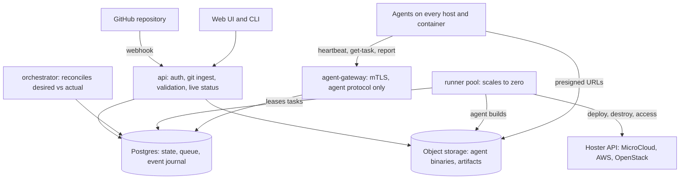
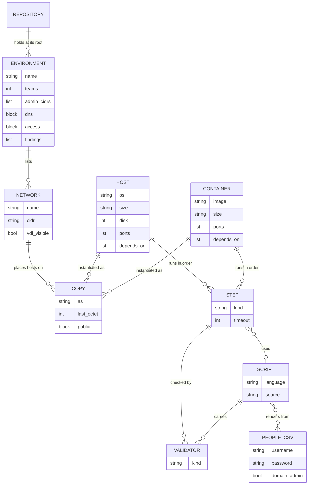
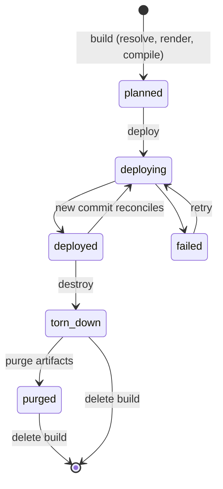

# LaForge 3.0: clean-slate rewrite plan

## Context

LaForge is being **fully rewritten**: new database schema, new services, new agent,
new agent protocol, new builders, new UI, new config format. No code, schema, ORM, or
wire format from the current system is carried over, and nothing in the new design is
shaped by what the old one happened to do.

Two things look back deliberately. **Content** is migrated: the volunteer repo
`/Users/lucas/git/globalcptc/infra` holds years of host definitions, networks, and
bash/PowerShell scripts, and a converter brings them into the new format. And the
current agent's command set is **reference for what hosts need done** — the new agent
covers the same ground with a new protocol and implementation.

Decisions already made:

- **Shape S2:** separate services (API/UI, orchestrator, agent gateway, builder runners) plus Postgres.
- **Infrastructure will change yearly** (OpenStack, MicroCloud, AWS, Rackspace...), so builders must be swappable and content must not name a hoster.
- **One maintainer today, and that is the problem being solved.** LaForge currently has
  a bus factor of one. The architecture, the module boundaries, and the documentation
  all exist to make that untrue: someone should be able to arrive, understand one piece,
  and contribute to it without holding the whole system in their head.
- **UI:** polished, modular app that will grow many functions over time.
- **Resilience:** today a build stalls if the server or a build dies. Builders are separate container images behind a narrow contract, work is leased and resumable, and nothing depends on one process surviving.
- **Containers are standard.** Every builder must deploy them, natively where the hoster has a container primitive and by running them on a small host where it does not. Not an author's concern.
- **Config:** new YAML format, no HCL. One environment object holds everything about a game; there is no separate competition object. **Host** and **Container** are separate things that share most fields and both live in `hosts/`. Environments sit at the repo root and attach hosts to networks. Stay extensible for a user database and for findings that feed a scoring system.
- **Validation is an optional decorator** on any step or script: file/user/group/registry/content checks that run after the step, with no separate file and no checking script. Old scripts work untouched without it.
- **Tags, vars, and findings are fields, not files.** Tags and vars are key/value maps on any object and cascade down (environment, then network, then host/container). Findings are an inline list (severity 1-5, difficulty 1-5, description) on any object, and a script's findings come along with the script.
- **Every team gets exactly the same network** (same CIDR, same addresses). Nothing is ever templated per team.
- **Files are typed by a header** (`host: web`, `environment: lm-test`), not by directory.
- **Content lifecycle is Git-native:** admins register a repository; a build is configured once against a branch, environment file, and builder config; after that every CI-passing commit to that branch is built. Authentication and authorization are GitHub's, per repository, for the UI and CLI alike.
- **Environment files never mention a builder or an IP supply,** so they can be reused year to year on any hoster. Server-side builder configs are kept separate from environment planning files.
- **Agent:** rewritten from scratch in **Rust**, as a single fully-embedded binary with no external configuration, hardened against reverse engineering by competitors.
- **Deploy target:** anywhere that runs containers. Railway is the current preference, but nothing may depend on it: plain Docker on a cloud VM must work equally well. Runners and the always-on services are costed separately and need not share a platform.

## Recommended stack

| Layer | Choice | Why |
| --- | --- | --- |
| Backend services | **Go** (decided) | Cheap concurrency for thousands of heartbeating sessions, small static images, one language for orchestrator/gateway/builders |
| Agent | **Rust** (see below) | Native binary with no runtime type/reflection metadata to leak, small footprint, strong default toolchain for stripping and hardening; a from-scratch design, not a port |
| UI | **React + TypeScript**, Vite, TanStack Router/Query, Tailwind, shadcn/ui, Lucide icons | All MIT or ISC, all public npm. shadcn components are copied into the repo rather than depended on, so there is nothing to license and nothing to lose access to |
| API | **Connect-RPC** (protobuf) plus SSE for live status | One schema generates both the Go server and the TS client; browser-friendly |
| DB | **Postgres**. `sqlc` + `goose` recommended | An ORM is acceptable if it earns its place. The requirement is that **we own the schema** as plain SQL migrations rather than having it generated out of model code. Postgres also carries the job queue and event journal |
| Objects | **S3-compatible**: R2, S3, Azure Blob, Railway Buckets, Tigris | Agent binaries, script and file artifacts. Anything durable a runner produces, and everything agents download. Egress matters here, so R2-style pricing is worth weighing. Railway volumes are single-attach, so not this |
| Config | **YAML**, validated by JSON Schema | See "YAML vs JSON" below |
| Auth | **GitHub, exclusively** | Web UI and CLI both. No local accounts, no internal permission tables: access to a repository in GitHub *is* access to its environments and builds |

### YAML vs JSON

**Recommendation: YAML**, validated by a JSON Schema (JSON Schema validates a
parsed YAML document just as well as parsed JSON — the schema doesn't care which
serialization was used). Reasoning:

- Volunteers hand-write these files, and a new author should be productive in under a
  day. That favors comments and low punctuation over strictness; JSON has no comments
  and demands quoting everywhere.
- `docker compose`, the closest well-known analogue for "pick a file and run it", is YAML.
- YAML is a superset of JSON: a tool or script that wants to emit config programmatically
  can just emit JSON and it validates as valid YAML. So choosing YAML doesn't foreclose JSON.
- Cost: YAML's whitespace/type-coercion footguns (`no` becomes a bool, indentation errors).
  Mitigated by strict schema validation at import time with specific, line-numbered errors,
  and a linter/formatter in CI and the editor (schema-driven autocomplete in VS Code).

## Services

Five services, one shared Postgres.

- **api:** the only service humans, the CLI, and the UI talk to. Handles auth, GitHub
  ingest/validation, and pushes live status. Fed by GitHub (repo) and the web UI/CLI.
- **orchestrator:** reads/writes Postgres; decides what should happen next; never
  talks to a hypervisor itself.
- **agent-gateway:** its own service, its own container, its own domain, scaled on its
  own. Speaks only the agent protocol. See below — it is the one service competitors
  can reach, so it is deliberately the smallest and least privileged thing we run.
- **runner:** pulls tasks, runs one builder image (microcloud, aws, openstack, ...)
  against the hoster API, reports back. Deployed with everything else; a pool, not a
  container per task.
- **agent:** the new binary, embedded in each host/container image, calls out to
  the agent-gateway only — never receives inbound connections.



Only the gateway is reachable from competition networks. Agents and runners both call
outward and never listen.

### The agent-gateway is its own service

Agents check in for the whole life of a build: heartbeat, ask for work, report results.
That traffic never stops, and it comes from inside the competition networks, so the
endpoint that serves it is separated from everything else on purpose.

- **Separate container, separate domain, scaled independently.** Thousands of agents on
  a short heartbeat is steady, modest, constant load, with a completely different shape
  from the UI or the orchestrator. It also has to stay up during an event, when the UI
  matters much less.
- **It is the only service competitors can reach**, so it stays small: speak the
  protocol, check the agent's identity, hand back queued tasks, record results. No UI,
  no GitHub integration, no builder code, no hoster credentials anywhere near it.
- **Least privilege in the database.** It connects as its own Postgres role that can
  record heartbeats and task results and read tasks addressed to the agent that asked.
  It cannot read builder configs, cannot reach another team's data, cannot start builds.
  Compromising the gateway must not hand over the competition.
- **Agents tolerate it being down.** They retry with backoff and keep their current work,
  so a restart or a deploy is not an incident.

**Scale at 4000 hosts.** The gateway is the one component where a big build shows up as
load, and there are two very different pressures on it.

*Check-ins* are steady and small. Four thousand agents on a thirty-second heartbeat is
a few hundred requests a second of tiny messages, which one Go service handles
comfortably. It stays easy if the service is **stateless and horizontally scaled**, with
Postgres as the only shared state and task lookup as a single indexed query per agent.
Two details stop it turning into a thundering herd: **jittered intervals**, so agents
deployed together do not stay synchronised for the rest of the event, and **long
polling** with backoff, so an idle agent is one held-open request rather than constant
retries.

*Artifact downloads are the real risk*, and the answer is that they never touch the
gateway. At T0 thousands of hosts provision at once and each wants scripts and files. A
100MB installer across 4000 hosts is 400GB in a burst, which would flatten an API
service and cost a fortune in egress. So **agents fetch artifacts straight from object
storage using short-lived presigned URLs**; the gateway only ever hands back the URL.
Bytes never pass through our services, the load lands on infrastructure designed for it,
and with R2-style pricing the egress is close to free. This is also why object storage
is a hard requirement rather than a convenience.

## Content lifecycle: GitHub-native

A repository holds a shared library (hosts, containers, networks, scripts, people) plus
one environment file per game or test. Content reaches a build like this:

1. **Admin registers a repository.** Authorization is GitHub's, per repository: if you
   can push to the repo, you can build its environments; if you cannot see it, it does
   not exist for you. There is no separate permission model to maintain. The CLI
   authenticates the same way, by GitHub device flow.
2. **Volunteers work in branches.** A branch can add/edit shared library content
   (networks, hosts, containers, scripts, people) and/or its own **environment**
   file at the repo root.
4. **Every push is a content revision.** The api ingests the commit, runs full schema
   validation, and reports pass/fail (PR check style) before anyone can build off it.
5. **Merging to main** is an ordinary GitHub PR/merge; LaForge does not special-case it —
   main is just another ref that happens to be the trunk.
6. **A build starts from an environment file** at a specific commit (`{repository, ref, environment file}`),
   plus the builder config to build it on (environments never name a builder):
   - **CLI:** `laforge build path/to/lm-test.yaml --builder microcloud`. The path is to the
     environment file inside a git checkout. The CLI works out the repository and commit from
     git, and that commit must already be pushed, since builds always come from a git
     commit.
   - **Web UI:** pick repository, ref, environment file, and builder config, then start.
   - **A build is always configured explicitly.** Nothing builds itself off a naming
     convention; the builder config is always chosen by a person, because it decides
     which hoster the game lands on.
7. **After that, it follows git.** Once a build is configured (repository, branch,
   environment file, builder config), every push to that branch builds the new commit,
   as long as CI passes. What happens then is set by an admin when the repository is
   added:
   - **Auto-build is on by default, always.** A commit that passes CI produces a
     resolved, rendered build. It costs nothing and touches no hoster, so there is no
     reason not to.
   - **Auto-deploy follows the environment's state by default.** If it is already
     deployed, the commit is applied to it, because a live environment drifting from its
     branch is what this exists to prevent. If nothing is deployed, it stops at the build
     and waits for someone to deploy.
   - **Both can be turned off per repository**, for an event where every deploy should be
     a decision someone makes deliberately.
   - "CI passes" means every check on that commit is green: LaForge's own validation
     (schema, builder-config checks) plus any GitHub checks the repo has, such as
     Actions. If the repo has no other CI, LaForge's validation alone decides.
   - If CI fails, nothing is built, and the failure shows against that commit in the UI.
   - Pushes that land while a previous commit is still waiting on CI collapse to the
     newest commit; only that one builds.
   - A new commit is applied to the existing build, not a teardown and rebuild from
     scratch. Only what changed is redeployed (see "Resilience design"): changed hosts
     are recreated, removed ones destroyed, new ones deployed.
   - Pushes to other branches do not touch this build.
   - **Marking the competition started locks automatic deploys.** A flag on the build,
     set when the event begins. Commits still build, so work carries on and stays
     reviewable, but nothing reaches the hoster on its own. Deploying during a live
     event becomes a decision made in front of the diff, knowing which hosts get
     recreated. Manual deploys, single-host rebuilds, and ad-hoc tasks all still work,
     because those are how a live event gets fixed.

Content authoring gets the same review and merge discipline as code, without asking
LaForge to understand merges itself.

## Resilience design (core of the rewrite)

A build must survive the server, a runner, or the database restarting at any moment.
The model is **desired state plus reconciliation**, never an imperative in-process
sequence:

1. A build declares desired state: N teams, each with networks, hosts, and containers, each with ordered steps.
2. The orchestrator diffs desired vs observed state in Postgres and creates **tasks** (deploy or destroy a network, host, or container; run a step).
3. **Leases:** a runner takes a task with `FOR UPDATE SKIP LOCKED`, gets a lease, and heartbeats. A dead runner's lease expires and the task is re-leased. Orchestrators are stateless replicas, so a crash mid-build just means another picks up.
4. **Idempotent builders:** every builder op is `ensure` (create-or-adopt), using deterministic resource names/tags, so a retry after partial success converges instead of duplicating.
5. **Blast radius:** failures are per team/host/container. The UI can retry, skip, pause, or force-destroy at any level. Retries use backoff and a cap.
6. **Event journal:** every state change is an append-only event, feeding status, audit, and post-mortems.
7. **New commit = new desired state.** Follow mode feeds each CI-passing commit into the same loop: diff against what is deployed, rebuild only what changed.

**What counts as changed: the rendered output is the fingerprint.** Everything that
produces a host is hashed together, and the hash decides.

| Changed | Effect |
| --- | --- |
| Anything rendered or built: vars the host uses, script contents, the step list, hostname, os or image, size, disk, ports, address, or a people CSV feeding one of its scripts | The host is rebuilt |
| Anything that only describes: tags, findings, descriptions | The database is updated; nothing on the hoster is touched |

This follows from how a host is produced, which is what makes it easy to reason about.
If a change would alter a single byte the agent receives, the host is rebuilt; if it
would not, it cannot matter to the host. Tags and findings never reach a script, so they
never cause work.

**Rebuild means recreate.** The host is destroyed and deployed again from a clean image,
because re-running steps over an existing machine is only safe when every script is
idempotent, and scripts that append to files or install packages usually are not.
Predictable, at the cost of losing whatever was on that host, which is exactly why a
competition can be marked as started.

Consequence: killing the server or a runner mid-build is a tested, normal event, not an incident.

### Where runners run

A runner is the process that talks to the hoster's API: create this network, deploy that
host, tear down team 3. The orchestrator never touches a hypervisor itself, it only
queues work; runners pull tasks and do them.

**Runners always run with the rest of LaForge. There is no second deployment model.**
No sponsor-side container, no tunnel service, nothing for a sponsor to operate or for
anyone to remember. Adding a hoster means writing a builder config, never standing up
infrastructure to reach it.

The requirement that makes this work, stated plainly, because it is now a sponsor
requirement like image aliases or quota:

> **A hoster's API must be reachable from LaForge, authenticated with credentials we
> hold.**

That is not a new constraint. It is how production already runs: the server reaches the
MicroCloud cluster at `https://<member>:8443` with a client certificate, and every other
builder target (AWS, OpenStack) is an internet API by nature. Incus, LXD, vSphere, and
the cloud APIs all authenticate with client certificates or keys, so exposing the
endpoint is not the same as exposing the cluster.

If a sponsor genuinely cannot expose their API, the fix is network access on their side
(a tunnel, a VPN, a published endpoint), arranged once during onboarding. That is an
operational workaround, deliberately **not** a second architecture inside LaForge.

**What is load bearing** is that a builder is its own container image behind a narrow
contract, so adding a hoster never means touching the core. How those images get run is
a deployment detail that can change later without redesigning anything.

### Runner lifecycle and cost

Runners are the only part of the system that should ever cost real money at rest, so
they scale to zero.

**What a runner does:** hoster API calls (deploy and destroy networks, hosts,
containers) and the agent build for that build's target platforms.

**What a runner does not do: run the game's scripts.** Those execute on the hosts
themselves, by the agent. The orchestrator queues a step, the agent-gateway hands it to
the agent when it checks in, and the agent runs it and reports back. A 4000-host
provisioning run costs almost no runner capacity, because the work happens out on the
hosts in parallel. Runner load tracks *how much infrastructure is being created*, not
how much provisioning is happening on it.

**A runner holds nothing durable. This is a design rule, not an aspiration.** If a
runner dies mid-task, nothing is lost, because nothing of value was ever only on it:

| Output | Where it lives |
| --- | --- |
| What got deployed, task and step status | Postgres |
| Task output, logs, timings | Streamed to the event journal as the task runs, never buffered to the end |
| Agent binaries from the agent factory | Object storage |
| Files served to agents | Object storage |
| What actually exists at the hoster | The hoster, re-derivable with `inspect` |

A runner is a worker with a scratch disk, and anything written to that disk is
disposable. A builder that needs local state between tasks is a builder doing it wrong.

**Runner work is bursty, which is what makes zero viable.** Runners only make hoster API
calls: deploy and destroy networks, hosts, and containers. That happens during a build,
a rebuild after a commit, and a teardown. Between those, there is nothing for a runner
to do. Steps running *on* hosts do not involve runners at all; they flow from the
orchestrator through the agent-gateway to agents. So the always-on cost is api,
orchestrator, agent-gateway, and Postgres, all small. Runners are the spiky part, and
they can sit at zero for weeks between events.

**"Per build" and "autoscaling pool" are the same mechanism.** Both come down to:
watch the queue, start runners when tasks are waiting, let them exit when the queue
drains. Framing it per build is the right mental model, but the implementation should
key on queue depth rather than on a build starting, because teardown, a follow-mode
redeploy, and a single-host rebuild all need runners too. One build also needs more than
one runner: 4000 hosts through a single worker would be serial and slow, so the pool
sizes to the work rather than to the event.

**Cheap and interruptible compute is safe here**, and it follows from the resilience
design rather than needing anything new. Tasks are leased with heartbeats, so a killed
runner's task returns to the queue. Builders are `ensure` operations with deterministic
names, so a retry after a half-finished create adopts what is there instead of making a
second one. That is exactly the contract spot and preemptible instances need. The same
property that survives a crash also survives being outbid.

**How runners get started** is a small `Launcher` interface with one implementation per
substrate, so where the pool runs is a config change rather than a redesign.

**Where it runs is a cost decision, and Railway is probably the wrong answer.** Bursty
work on a platform priced for always-on services is the expensive combination. Three
candidates:

| Option | Cost to us | Catch |
| --- | --- | --- |
| **The sponsor's infrastructure**, as containers beside the cluster they manage | Nothing. The capacity is already donated, and a few runner containers is a rounding error beside 4000 VMs. Lowest latency to the API too. | Puts builder credentials inside the competition's blast radius, and couples the tooling to the thing it manages. |
| **Our own cheap compute** (a small provider, spot instances, or a box at the university) | Low. Runners are small and short-lived, so a burst is minutes of a cheap instance. | One more thing to own, though only for us and invisible to sponsors. |
| **Railway** | Highest at burst, for exactly the shape of work we have. | Simplest ops, since everything else already lives there. |

**Bootstrapping the sponsor-side option is solved**, which is worth spelling out because
it looked circular earlier. LaForge must already reach the hoster API, since that is the
sponsor requirement above. So the orchestrator can launch runner containers *through
that same API*, with no human step and nothing for a sponsor to install. The earlier
bootstrap problem only existed when the API was unreachable, and that case is ruled out.
It does mean the orchestrator makes one narrow hoster call directly — "start a container
from this image with this token" — which bends the rule that only runners touch
hypervisors. A deliberate, tiny exception: one call, not the builder surface.

**The catch that matters for CPTC.** A runner holds the builder credentials: the client
certificate or cloud keys that can create and destroy everything, for every team.
Running that container on the same cluster competitors are attacking puts those keys
inside the blast radius. The isolation involved is the same isolation the whole game
already depends on: one project per team, OVN networks, no inter-team peering, and a
separate project for the runner with no route to team networks. What differs is the
consequence of failure. A team reaching another team's network is a fairness problem; a
team reaching a runner is a total compromise of the competition.

Mitigations if we go that way: a dedicated project with no route to any team network,
credentials scoped as far as the hoster allows, and runners destroyed the moment the
queue drains, so they exist for minutes rather than days. Scale-to-zero helps twice
here, once on cost and once on exposure.

**Recommendation: our own cheap compute.** It captures most of the saving against
Railway, keeps the keys outside competitor reach, and keeps the tooling working when the
cluster it manages is having a bad day, which is exactly when a range needs rebuilding.
The sponsor-side option stays available through the same `Launcher` if a year's
economics justify the tradeoff.

**To confirm in the spike:** real burst costs on two or three cheap substrates, and
whether Railway can scale on queue depth at all, since that decides whether it is even
in the running.

## The agent: full rewrite, hardened

The current agent binary is useful **reference for what commands hosts need**, since
that set came from years of real content. Nothing about its architecture, protocol, or
implementation carries over. Designed from scratch against these requirements:

- **Single embedded binary, zero external configuration.** No config file, no
  environment variables, no sidecar cert files on disk. Callback URL, pinned
  gateway public key/cert, and a per-host/container identity/token are baked into the
  binary at build time, by the **agent factory**.
- **The factory compiles per team, then personalises per host.** A Rust build takes
  minutes, so compiling per host would be absurd at 4000 hosts, and compiling once for
  everyone would mean every team running a byte-identical binary. Both are wrong. The
  factory compiles once per **team per target platform** — 20 teams across Linux and
  Windows is 40 builds, parallel across the runner pool — then produces each host's
  binary by patching an encrypted identity blob into a copy of its team's build:
  milliseconds each. Compiles land in object storage; personalised copies are fetched
  from there when a host is deployed.
- **Credentials never span teams.** A team's build carries its own client certificate
  and its own pinned gateway key, and the identity blob patched in per host carries that
  host's own keypair. Pulling a certificate out of one agent buys that host, inside that
  team, for that build, and nothing else. The gateway enforces it: a credential issued
  for team 7 can only ever act as a team 7 host.
- **Per-team builds also break binary diffing.** Each team's compile uses a different
  obfuscation seed, so two teams' agents are structurally different rather than
  identical-except-for-a-blob. Without that, anyone holding two agents could diff them
  and find the configuration blob immediately.
- **Reverse-engineering resistance is a real requirement, with a real ceiling.**
  A local binary can always be fully reverse engineered by an attacker with
  unlimited time; the goal is raising cost and time-to-analyze past what a
  competition round allows, not "unbreakable." Concretely:
  - Compiled to native code, **stripped** of symbols/debug info, with no reflection
    or type-name metadata left in the binary.
  - Sensitive constants (gateway address, expected pins) are not plaintext
    strings in the binary — simple XOR/obfuscated-at-rest, decoded in memory.
  - Optional control-flow obfuscation via LLVM-based passes (OLLVM-style) as a
    build step, evaluated for compile-time cost.
  - Basic anti-debug / anti-tamper self-checks (self-hash, ptrace/IsDebuggerPresent
    detection) that degrade gracefully (log + continue) rather than being
    load-bearing for security — the protocol obscurity and mTLS/token model
    are the real control; obfuscation buys time, it is not the boundary.
  - No verbose error strings, panics, or stack traces reachable by a local user.
- **Language options**, scored on native-binary hygiene + cross-compiling to
  Windows and Linux + toolchain maturity for stripping/obfuscation:

  | Language | Fit |
  | --- | --- |
  | **Rust** (leaning choice) | No runtime reflection metadata, excellent stripping (`strip`, `panic = "abort"`, no unwinding tables), single static binary via `musl`/`+crt-static`, first-class Windows + Linux cross-compilation, mature ecosystem for the callback/mTLS client code |
  | C / C++ | Smallest possible binary and most mature obfuscation tooling (OLLVM), but memory-safety risk in a binary sitting in a hostile network is a real cost |
  | Zig | Very clean cross-compilation and small binaries, obfuscation tooling far less mature |
  | Go | Same language as the services, but the runtime embeds package paths, type descriptors, and goroutine/GC metadata that survive stripping and make behavioural analysis meaningfully easier; would need extra tooling (e.g. `garble`) to close that gap |

- **Protocol: mTLS over TCP, with minimal framing inside.** The agent opens a TLS
  connection to the gateway on a plain port and presents its client certificate; the
  gateway presents a certificate the agent pinned at build time. Inside the tunnel is a
  small length-prefixed binary framing carrying three verbs: `heartbeat`, `get-task`,
  `report-status`.

  This is deliberately **not** a custom handshake. An earlier draft of this plan proposed
  one, and it was the weakest idea in it: hand-rolled cryptography is how competent
  projects get broken, and this has to hold against people whose entire purpose that
  weekend is breaking things. TLS is scrutinised, well implemented in Rust by `rustls`,
  and gives mutual authentication for free from the per-team and per-host certificates
  the agent factory already produces.

  Obscurity survives where it matters. An observer sees a TLS connection to a port,
  which tells them nothing: framing, verbs, and payloads are all inside the tunnel. The
  goal was never to hide that the agent talks to something, only to make working out
  what it says expensive.

  It is also the easiest thing to host, since every platform can forward a TCP port.
- **Command set:** see "Agent commands" below. Ansible-local is dropped.
- **Container variant:** the same binary (or a thin variant) runs as PID 1 or
  a sidecar inside a container image, so containers get the same step/finding
  model as hosts without opening any inbound exec path into the container.

### Agent commands

The full set the agent can execute. Every command takes **structured arguments**
(typed fields in the protocol), works on Linux and Windows, and reports status, output,
and an error separately.

**Files**

| Command | Arguments | Notes |
| --- | --- | --- |
| `download` | url, destination path, mode | Pulls from the LaForge file endpoint, never from a jump box. |
| `upload` | source path | **New.** Sends a file back (logs, generated creds, evidence). Nothing like it today. |
| `write_file` | path, content, mode | **New.** Today writing a whole file means downloading one or appending to an empty file. |
| `append_file` | path, content | |
| `extract` | archive path, destination folder | zip/tar/tgz. |
| `delete` | path | File or directory. |
| `change_perms` | path, mode, owner, group | Mode is chmod-style on Linux, ACL-mapped on Windows. Owner/group are **new**. |
| `validate` | a list of checks | Runs every check and reports each result. See "Validation". The check list grows over time; the command itself does not change. |

**Users and groups**

| Command | Arguments | Notes |
| --- | --- | --- |
| `create_user` | username, password, groups | |
| `set_password` | username, password | Separate from create, so a step can rotate a password. |
| `add_to_group` | username, group | |

**Execution and lifecycle**

| Command | Arguments | Notes |
| --- | --- | --- |
| `execute` | command, args, working dir, timeout, run-as | Structured argv, never a joined string, so quoting and spaces are safe. |
| `service` | name, action (start/stop/restart/enable/disable) | **New.** systemd or Windows services. Today this is hand-rolled inside scripts. |
| `reboot` | delay | Reports success before rebooting, then re-registers on boot. |

**Design rules for the command set**

- **Structured arguments, always.** The current protocol joins arguments into one string
  with an emoji delimiter and substitutes another emoji for newlines. Any content
  containing those characters corrupts. The new protocol has typed fields.
- **Idempotent where it can be.** `create_user` on an existing user, `add_to_group`
  when already a member, and `extract` over existing files all succeed rather than fail,
  so a re-run after a partial failure converges.
- **Every command reports** exit status, stdout/stderr, and duration, kept in the event
  journal against that step run.
- **Step kinds are not 1:1 with commands.** A `script:` step expands to `download` then
  `execute`; a `schedule:` step registers a timer that later issues `execute`. The
  server does the expanding; the agent only ever sees commands from this list.
- **Adding a command is a protocol change**, so the list is deliberately small. Anything
  expressible as a script stays a script.

## Builder contract

Builder = container image implementing a small, from-scratch contract
(protocol is language-neutral; a builder can be Go, bash, or Python):

- `deploy_network`, `deploy_host`, `deploy_container`, `destroy_*` (all safe to repeat: create if missing, adopt if already there), `inspect` (list what exists, for adoption and drift), `open_access` and `close_access` per team, `capabilities` (e.g. `windows`, `containers`, `dns`, `public`).
- Input: task JSON plus a short-lived scoped token. Output: progress events and result.
- Hoster credentials live in a **builder config** (secret refs), never in content.
- **Image and size portability:** content says `os: windows-server-2022`, `size: medium`. Each builder config maps abstract names to concrete images/sizes/container templates.
**Builders call hoster APIs directly. No Terraform or OpenTofu layer.** Earlier drafts
of this plan carried a "tofu builder" idea forward out of habit; it does not survive
contact with the rest of the design. Tofu is a desired-state reconciler with its own
state files, and we already have a desired-state reconciler backed by Postgres. Putting
one inside the other means two systems deciding what exists, per-team state files to
lock and reconcile, drift between tofu's view and ours, and error messages that belong
to tofu rather than to a host we can name in the UI. It also fights the granularity we
actually need, since rebuilding one host for one team is a targeted apply, which is
exactly the operation Terraform discourages.

The trade would be worth considering if we had no reconciler and wanted one for free.
We have one, and it is the centre of the design. Nothing stops someone writing a
tofu-backed builder later, since the contract does not care what a builder does
internally, but it is not a blessed path.

**`close_access` and `open_access` are required, and the contract is behavioural.**
Closing a team must **block all external ingress and terminate established connections**,
not merely stop new ones. A student mid-RDP at the close time loses the session; leaving
them connected while their teammates are locked out is the fairness problem this exists
to prevent. How that is achieved is entirely the builder's business, because it differs
per hoster and will change as hosters change: removing a forward, an OVN ACL that drops
on connection state, a security-group or network-ACL change, or all three.

Three properties the implementation must hold regardless of mechanism:

- **Nothing external reaches the team once `close_access` returns.** Not new connections,
  not established ones. "The rule changed but the session stayed up" is the failure this
  requirement is written against, and a builder is not finished until it demonstrably
  drops a live session.
- **Port reservations survive.** Reopening restores the same external address and port,
  because students reconnect with the details they already have.
- **Both operations are idempotent.** Closing a closed team succeeds quietly, which
  matters when a schedule and a manual override land at the same moment.

Every builder is written from scratch against this contract. Build order by expected
sponsor use: MicroCloud/Incus first, then AWS, OpenStack, vSphere/NSX-T, Rackspace as
needed.

### Containers as a first-class deploy target

`Container` is authored as its own file type (see "Environment planning files"). What
varies between hosters is only *how* a container gets deployed, never whether it can be:

| Builder | Native container primitive |
| --- | --- |
| Incus / MicroCloud | LXC system containers, alongside VMs, same API |

**Windows is not optional.** CPTC is an Active Directory pentest, so any builder used
for a real event deploys Windows. Base images already exist, so this is ordinary work
inside the MicroCloud builder milestone: wire up the images, and build the Windows agent
alongside the Linux one.
| AWS | ECS Fargate / EKS (needs a decision: which one we standardize on) |
| OpenStack | Zun, where deployed (often absent) |
| vSphere | vSphere with Tanzu, or none on plain vSphere |
| Rackspace / unknown future sponsor | Unknown until contracted |

**Containers are standard, and it is the builder's problem.** An environment that
declares a container gets a container, on every hoster. A builder with a native
container primitive uses it. A builder without one falls back on its own, by deploying a
small host and running the image on it with a container runtime. There is no policy
knob in the environment file and nothing for an author to configure: containers are
part of the contract every builder has to satisfy.

A builder may only refuse when the request is genuinely impossible to honour, such as a
Windows container image on a hoster with no Windows at all. That fails validation
before the build starts, with a clear message.

## Environment planning files (in git)

There are six file types: **environment, network, host, container, script, people.** A people CSV is data rather than config, but it lives in the repo with everything else.
Tags, vars, and findings are not files; they are fields on any of them.



Hosts, containers, and networks never reference each other; only the environment does,
through copies. Tags, vars, and findings are fields on any object rather than types of
their own, so they do not appear here.

**Rules that never change:**
- **Every team gets exactly the same network.** Same CIDR, same addresses, same last
  octets. Nothing is ever templated per team. Isolating teams from each other is the
  builder's job, not the config's.
- Host and container files are reusable and know nothing about networks or addresses.
  An environment attaches them to networks and gives them their last octet.

### How files are identified

Every document starts with a header line, `<type>: <name>`, which is what declares both
what the object is and what it is called. The type comes from that header, never from
the directory a file sits in; directories are only for organization. Names are unique per type. Hosts and
containers share one namespace, because an environment refers to either by name. One file can
hold several objects separated by `---`.

```text
lm-test.yaml                 environments live at the repo root
cptc-finals.yaml
hosts/                       host and container files (both go here)
networks/
scripts/  (each script yaml + its .sh / .ps1 / .bat source beside it)
people/   (CSV files: the cast of the game)
files/                       plain artifacts, no config
```

### Tags, vars, and findings (any object)

Tags and vars are plain key/value maps in any file. They cascade down automatically:

| Set on | Visible to |
| --- | --- |
| environment | everything in the environment |
| network | every host and container on that network |
| host or container | that host or container only |

Precedence when the same key appears twice: environment < network < host/container. There is
nothing more specific than host/container in this model — an environment's topology only
gives a copy its `as` name, `last_octet`, and optional `public` ports, no per-copy vars. Scripts do not have
vars; put the value directly in the script. Builder config is never exposed to
authors and takes no vars at all.

Findings are just an inline list on any object (environment, network, host, container,
script). Three fields, nothing else. No names, no IDs, no separate files:

```yaml
findings:
  - severity: 4        # 1-5
    difficulty: 2      # 1-5
    description: SQL injection in the login form
```

A finding on a script comes along with the script to every host or container that
runs it. Export is a CSV with one row per finding: the object it is attached to, plus
severity, difficulty, and description.

### Network

`network: <name>`. Fields: `cidr`, `vdi_visible`, `vars`, `tags`. The CIDR is
fixed and identical for every team.

```yaml
# networks/prod.yaml
network: prod
cidr: 10.0.1.0/24
vdi_visible: true
tags: { scope: in }
vars: { authoritative_dns_ip: 10.0.1.6 }
findings:
  - severity: 3
    difficulty: 2
    description: Flat network, no segmentation between servers
```
```yaml
# networks/dev.yaml
network: dev
cidr: 10.0.2.0/24
```
```yaml
# networks/vdi.yaml
network: vdi
cidr: 10.0.254.0/24
vdi_visible: true
tags: { scope: out }
```
```yaml
# networks/vpn.yaml
network: vpn
cidr: 10.0.255.0/24
vdi_visible: true
```

**Public access.** Optional, and it does nothing unless defined. A host or container
copy in the environment can carry a `public` object that lists the ports that must be
reachable from outside (see "Environment"). That is all an environment file says: no addresses, no
mapping. The builder decides how to make those ports public, so the same environment works on
any hoster:

| Builder | How it makes the ports public |
| --- | --- |
| MicroCloud | Each public port is mapped to a random free external port on the address(es) in its builder config, most likely one address for the whole competition. |
| AWS | The host gets its own public IP, same ports. |
| OpenStack | Likely a floating IP per host. |

- Random external ports are picked once and remembered per team, host, and port, so they
  stay the same when follow mode redeploys.
- If the builder cannot satisfy the environment (for example 20 teams x 4 public ports but a
  pool of 60), the build fails validation before it starts, with the numbers.
- **Listing:** the builder reports every external endpoint (team, host, internal port,
  external address:port). It is available in the UI, from the CLI, and through the API
  whenever needed. For example team 7's WireGuard might be `203.0.113.10:20031`.
- Whether a network is reachable from the VDI network is a separate thing and stays
  `vdi_visible` on the network.

### Host

`host: <name>`, in `hosts/`. Fields: `os` (abstract), `size` (abstract), `disk`,
`ports`, `depends_on`, `steps` (ordered), `vars`, `tags`, `findings`, `people`. No
network, no IP address. The machine's hostname is the `as` name given in the environment.

`depends_on` lists hosts, containers, or networks that must be up first (a workstation
waits for the domain controller, or for a whole network). It lives here, not in the
environment or network.

Entries name the **object**, not a copy: `depends_on: [database]`, never `db01`. Since
one object can be placed several times, a copy waits for **every copy of that object
within its own team**. Names are bare, and the linter rejects a repo where a network and
a host/container share a name. A host always waits for its own network implicitly. A
dependency naming something not in the environment fails validation.

```yaml
# hosts/database.yaml
host: database
os: ubuntu22
size: medium
disk: 80
ports: { tcp: ["3306"] }
tags: { role: db }
findings:
  - severity: 5
    difficulty: 1
    description: Database root password is the default
steps:
  - script: base
  - script: install-mysql
  - create_user: { name: dbadmin, groups: [sudo] }
```
```yaml
# hosts/webserver.yaml
host: webserver
os: ubuntu22
size: small
disk: 40
ports: { tcp: ["80", "443"] }
depends_on: [database]
steps:
  - script: base
  - download: { from: files/site.tar.gz, to: /var/www/site.tar.gz }
  - extract:  { src: /var/www/site.tar.gz, dest: /var/www }
  - script: vuln-sqli
  - schedule: { cron: "*/30 * * * *", script: reboot }
```
```yaml
# hosts/workstation.yaml
host: workstation
os: windows-server-2022
size: medium
disk: 100
ports: { tcp: ["3389"] }
depends_on: [domain-controller, prod]   # a host, and a network
steps:
  - script: join-domain
```
```yaml
# hosts/kali.yaml
host: kali
os: kali
size: large
disk: 256
ports: { tcp: ["1-65535"], udp: ["1-65535"] }
steps:
  - script: prepare-kali
```
```yaml
# hosts/wireguard.yaml
host: wireguard
os: ubuntu22
size: small
disk: 50
ports: { tcp: ["51820", "23226"], udp: ["51820"] }
steps:
  - script: install-wireguard-server
```

### Container

`container: <name>`, also in `hosts/`. A separate thing from a host that shares most of
the same fields: `image`, `size`, `ports`, `depends_on`, `steps`, `vars`, `tags`,
`findings`, `people`. No disk, no network, no IP address.

```yaml
# hosts/scoreboard.yaml
container: scoreboard
image: laforge/scoreboard:latest
size: small
ports: { tcp: ["8080"] }
steps:
  - script: scoreboard-seed
```

### Environment

`environment: <name>`, at the repo root. One per game or test. A build starts from an
environment file (see "Content lifecycle").

Game settings: `schema`, `description`, `teams`, `admin_cidrs`, `vdi_ports`,
`root_password`, `start`/`stop`, `dns`, `vars`, `tags`, `findings`.

**DNS.** Every host and container gets an A record generated from its `as` name and its
address, for every team, with no authoring required. Build scripts can rely on every
hostname resolving. The `dns` block adds custom records on top for anything generated
names cannot express.

Topology is a map of **network, then host or container name, then a list of copies**.
Each copy has `as` (the hostname of that copy), `last_octet`, and optionally a
`public` object listing the ports to make reachable from outside (see "Public access").
Leave `public` out, or set it to `false`, and nothing is made public. The IP is the
network's CIDR plus that octet. Listing a host twice puts two copies of it on the
network. A copy sits on exactly one network (no dual-homed hosts for now).

```yaml
# lm-test.yaml
environment: lm-test
schema: 1
description: Builder test environment
teams: 5
admin_cidrs: [129.21.0.0/16]
vdi_ports: ["1-65535"]
root_password: P@ssword123        # in the clear; it is meant to be found
start: 2026-10-01T09:00:00Z
stop:  2026-10-03T17:00:00Z
dns:
  type: bind
  root_domain: allports.local
  dns_servers: [8.8.8.8, 8.8.4.4]
  ntp_servers: [129.6.15.28]
  records:                           # A records for every host are automatic; these are extra
    - { name: intranet, type: CNAME, target: web01 }
    - { name: mail, type: MX, target: mail01, priority: 10 }
vars: { company: Allports }
tags: { event: test }

networks:
  prod:
    database:
      - as: db01
        last_octet: 11
    webserver:
      - as: web01
        last_octet: 12
    scoreboard:                        # a container, same syntax
      - as: scoreboard
        last_octet: 50
  dev:
    database:
      - as: devdb
        last_octet: 5
  vdi:
    kali:                              # same host, two copies
      - as: kali01
        last_octet: 201
      - as: kali02
        last_octet: 202
  vpn:
    wireguard:
      - as: wireguard
        last_octet: 5
        public:                        # optional: ports to make reachable from outside
          tcp: ["51820"]
          udp: ["51820"]
```

### Validation (optional, on any step)

Did the step actually do what it claimed? A `validate` block answers that without
anyone writing a checking script. It is **optional everywhere** — every existing script
works untouched with no `validate` block at all.

It attaches in two places:

- **On a step**, checking that one step.
- **On a script definition**, so every host or container that runs the script gets the
  checks automatically — the same way a script's findings and people flow to whatever
  runs it.

```yaml
# on a step
steps:
  - script: install-mysql
    validate:
      - service_running: mysql
      - port_listening: 3306
      - user_exists: dbadmin
```
```yaml
# on a script definition: flows to every host that runs it
script: harden-web
language: bash
source: harden-web.sh
validate:
  - file_contains: { path: /etc/nginx/nginx.conf, text: "server_tokens off" }
  - file_absent: /var/www/html/index.nginx-debian.html
```

**Starting validators.** Each is a named check with typed arguments:

| Validator | Arguments | Platform |
| --- | --- | --- |
| `file_exists` | path | both |
| `file_absent` | path | both |
| `file_hash` | path, sha256 | both |
| `file_contains` | path, text **or** regex | both |
| `user_exists` | username | both |
| `group_exists` | group | both |
| `user_in_group` | username, group | both |
| `service_running` | service name | both |
| `port_listening` | port, protocol | both |
| `process_running` | process name | both |
| `registry` | key, value, expected data | Windows |

**Rules**

- **Runs after the step** it is attached to, in order. Every check runs even if an
  earlier one fails, so one run reports every problem rather than only the first.
- **A failed check fails the step**, showing which check failed and what it found
  instead. It respects the step's `ignore_errors`, so a check on a best-effort step
  warns rather than stops the build.
- **Checks are read-only.** A validator never changes the host, and none of them run
  arbitrary commands. A step that needs to *run* something already fails the build when
  that command exits non-zero, so there is no "run this and check the exit code"
  validator: that is just a step.
- **A step can be validation only** — no action, just a `validate` block — as a
  checkpoint partway through a host's steps.
- **Wrong platform is a validation error, not a runtime surprise**: `registry` on a
  Linux host fails when the environment is validated, before the build starts.
- **Adding a validator does not change the protocol.** The `validate` command carries a
  list of checks; a new check is a new entry the agent knows how to run, shipped with
  the next agent build.
- **Results land in the event journal** against that step run, so the UI can show
  exactly which check failed on which host, for which team.

### Script

**Scripts are templates, rendered per host per team before delivery.** The context is
everything the server knows about where the script is about to run:

| In scope | What it is |
| --- | --- |
| `vars` | Merged environment, network, and host vars |
| `people "<name>"` | Rows from that people CSV |
| `host` | Hostname, address, network, team number |
| `network` | Name, CIDR, other hosts on it |
| `build` | Environment name, team count, timings |

A script is therefore free to generate whatever the platform needs, which is why account
creation, DNS records, and per-team configuration all work without any of them being
features of the config format.

**Authors can see the context without deploying anything.** Templating is powerful and
barely used today, and the reason is discoverability: the only way to find out what is
in scope is `hosts/variables_stub.laforge`, a fake host that exists purely to run
`scripts/variables.txt` and dump the variables into a file someone then goes and reads.
Deploying a host to learn what a template can reference is why nobody bothers.

Everything in the context is derivable from the content files alone. Addresses come from
the network CIDR plus `last_octet`, team numbers are known, vars merge statically. So it
can all be answered locally, with no build and no infrastructure:

```
laforge context lm-test --host web01 --team 3
```

prints the whole context for that host, in that team, as readable YAML: every var with
where it came from in the cascade, the people sources and their columns, host and
network facts, build facts.

```
laforge render scripts/create-linux-users.sh --host dc01 --team 3
```

renders a real script against real data and prints the result, so an author sees the
exact text that would run before anything is built. Both work against a checkout, in a
second, which is the difference between a feature people use and one they avoid.

The same rendering is available in the UI for a host in a live build, which is the
fastest way to answer "why did this script do that on team 12".

**Unknown references fail at validation, not at 3am.** Templates render in strict mode,
so `{{ .hostnme }}` is an error when the commit is validated, naming the file and line.
A typo in a template should never reach a build.

### Checking a repo before pushing

```
laforge check
```

renders **everything**: every script against every host, in every team, exactly as a
build would. Rendering is microseconds, so forty thousand combinations is a second or
two, and it is the only way to catch the failures that only appear for one host or one
team. Alongside the renders it checks schema conformance, name collisions, `depends_on`
targets that exist, public ports being a subset of the host's ports, and validators
asking for the wrong platform.

**It is the same code path as the per-commit validation.** The server runs this on
push; the CLI runs it on a checkout. Same binary, same answers, so "passes locally,
fails in CI" does not happen.

### Editor support

The current extension is syntax highlighting for `.laforge` files and nothing more,
despite advertising autocompletion. The replacement is a **language server**, so the
logic lives once in Go beside the validator, and VS Code, Neovim, and anything else
speaking LSP get it for free. The VS Code extension becomes a thin wrapper.

| Feature | Behaviour |
| --- | --- |
| Diagnostics | Schema errors, unknown template references, unknown script/host/network names, collisions. The same checks as `laforge check`, live as you type. |
| Completion in config files | Driven by the JSON Schema, so every field and enum is offered with its documentation. |
| Completion in scripts | Offers the real template context: vars, people columns, host and network facts. |
| Hover | What a var holds and **which file it came from** in the environment/network/host cascade. |
| Go to definition | A script name jumps to the script, a host name to the host file, a people source to the CSV. |
| Live preview | The rendered script beside the source, updating as you type. |
| "Show everything available" | A command that opens the full context for the pinned host, the same output as `laforge context`. |

**Completion in a script has to answer "in scope where?"**, because one script can run on
several hosts with different vars. Two things together solve it:

- **Completion offers the union** of every context the script runs in, marking anything
  that is not available everywhere: `db_name` shows as available on 2 of the 5 hosts
  that run this script. That warning is worth more than the completion, since a var that
  exists on one host and not another is the classic way a script works for one team and
  not the rest.
- **A pinned context** (host and team, chosen in the status bar) drives the live preview
  and hover values, so there is always a concrete example on screen.

`script: <name>`, with its source file (`.sh`, `.ps1`, `.bat`) beside it. Fields:
`language`, `source`, `timeout`, `args`, `ignore_errors`, `tags`, `findings`, `validate`.
No vars. Its tags, findings, and validation checks flow to every host or container that
runs it.

```yaml
# scripts/vuln-sqli.yaml     (vuln-sqli.sh sits beside it)
script: vuln-sqli
description: Web login with an injectable username field
language: bash                    # bash | powershell | batch
source: vuln-sqli.sh
timeout: 300
tags: { category: web }
people: [jdoe]
findings:
  - severity: 4
    difficulty: 2
    description: SQL injection in the login form
```
```yaml
# scripts/reboot.yaml
script: reboot
language: bash
source: reboot.sh
```

### Steps

The `steps:` list on a host or container, not a file. Each kind is backed by one or
more agent commands (see "Agent commands").

```yaml
steps:
  - script: base                            # download + execute a script definition
  - run: systemctl restart nginx            # inline one-liner, no script file
  - download: { from: files/site.tar.gz, to: /tmp/site.tar.gz }
  - upload:   { from: /var/log/setup.log }  # back to LaForge
  - write_file: { path: /etc/motd, content: "Property of Allports" }
  - append_file: { path: /etc/hosts, content: "10.0.1.11 db" }
  - extract:  { src: /tmp/site.tar.gz, dest: /var/www }
  - delete:   { path: /tmp/site.tar.gz }
  - change_perms: { path: /var/www, mode: "0755", owner: www-data, group: www-data }
  - create_user:  { name: dbadmin, password: "{{ vars.db_pw }}", groups: [sudo] }
  - set_password: { name: Administrator, password: "{{ vars.admin_pw }}" }
  - add_to_group: { user: www-data, group: docker }
  - service: { name: nginx, action: restart }
  - reboot: {}
  - schedule: { cron: "*/30 * * * *", script: reboot }

  # any step can carry an optional validate block
  - script: install-mysql
    validate:
      - service_running: mysql
      - user_exists: dbadmin
      - file_exists: /etc/mysql/my.cnf
```

### People

**A people CSV is data, not configuration.** It is the cast of the game: who works at
this company, their names, titles, departments, and passwords. The current repo has 1093
generated `identities/*.laforge` files produced from one CSV, and that friction is why
the feature goes unused. The CSV is the real artifact, so the new format keeps it as a
CSV and does nothing clever to it.

```csv
# people/employees.csv
username,first_name,last_name,email,password,title,department,domain_admin,sudo,enabled
arivera3,Aaron,Rivera,aaron.rivera@allports.tours,818815997,Receptionist,Administration,false,false,true
aroberts,Abigail,Roberts,abigail.roberts@allports.tours,nixiewater,Casino Dealer,Entertainment,false,true,true
```

It does two things, and deliberately nothing else.

**1. It is the user database.** Every CSV under `people/` is ingested and browsable in
the UI, searchable by name, username, department, or anything else in it, and readable
through the API. During an event, "what is Aaron Rivera's password" and "who are the
domain admins" have an answer without anyone opening a spreadsheet. This is the part
that grows later.

**2. It is available to scripts as template data.** Never as a file on the host. The
rows are in the template context, so a script generates exactly the account-creation it
needs and nothing else is written down:

```bash
# scripts/create-linux-users.sh
{{ range people "employees" }}
useradd -m -s /bin/bash -c "{{ .first_name }} {{ .last_name }}" {{ .username }}
echo '{{ .username }}:{{ .password }}' | chpasswd
{{ if .sudo }}usermod -aG sudo {{ .username }}{{ end }}
{{ end }}
```

This keeps the existing shape: scripts are already Go templates rendered server-side,
and identities are already in that context today. The basic scripts for domain
controllers, Windows, and Linux carry over with their data handed to them instead of
generated into a thousand files.

**Why creation is a script and not a feature.** A user is never just a username and a
password. On Linux it needs a home directory, a shell, a group, maybe an SSH key. In
Active Directory it needs a real object with title, department, phone numbers, an email
address, group memberships, and an OU to live in. Anything expressive enough to cover
both would be a worse version of the scripts that already exist.

**Fewer artifacts on the box.** A CSV of every username and password sitting in
`C:\provision\` is a gift to whoever finds it, and it stays there for the whole event.
A rendered script holds the same data only while it runs, and **the agent removes the
rendered script once the step completes**. Worth being straight about the limit: during
execution the credentials are on disk, and a competitor with a shell at that moment can
read them. The window goes from the length of the competition to the length of one step,
which is the real improvement, not perfect secrecy.

To give one host a subset, filter in the template or write a second CSV.

**Referencing a person.** `people: [arivera3]` on any object refers to a row by
username, so a finding or a host can point at whoever it concerns. There is no
per-person file type.

### Extends (additive only)

`extends: <name>` on an environment, network, host, or container. It only adds: new keys, new
map entries, and appended list items (steps, ports, copies). It never replaces or
removes anything from the base. A conflict on an existing single value is a validation
error rather than a silent override.

```yaml
# hosts/webserver-hardened.yaml
host: webserver-hardened
extends: webserver
steps:                            # appended after webserver's own steps
  - script: harden-web
```
```yaml
# lm-test-large.yaml
environment: lm-test-large
extends: lm-test
networks:
  prod:
    database:                     # adds one more copy to the base environment
      - as: db02
        last_octet: 13
```

### Open gaps in the config model

- **`public` ports vs the host's `ports`.** Every public port must also be in the host's
  `ports` list, or validation fails. A host cannot publish a port it does not serve.
- **DNS records.** The environment carries a `dns` block. Open: whether individual
  records need authoring, or generating A records from hostnames is enough.

## Server-side configuration (builder configs, not in git)

Separate from the environment planning files above. Environment files describe the game and never
mention a hoster, so they can be reused year to year. Builder configs describe one
hoster and live only on the server.

A builder config holds connection details, credentials, the mapping from the abstract
`os` / `size` / `image` names used in content to what that hoster actually has, and
whatever that hoster needs to make ports public. It is registered under a friendly name
and chosen when a build starts. Admins own it, authors never see it, and it takes no vars
and is not run through variable processing. The builder itself declares what it
supports (Windows, containers), so that is not part of the file.

```yaml
# builder config: microcloud (server-side only)
name: microcloud
builder: incus
url: https://mc1.example:8443
credentials: secret://microcloud-client
images:
  ubuntu22: ubuntu/22.04
  kali: images:kali
  # windows-server-2022 not listed: an environment using it fails validation before build
sizes:
  small:  { cpu: 2, memory: 4GiB }
  medium: { cpu: 4, memory: 8GiB }
  large:  { cpu: 8, memory: 16GiB }
public_addresses: [203.0.113.10]     # addresses available for public ports
public_port_pool: 20000-39999        # external ports are picked at random from here
```
```yaml
# builder config: aws (server-side only)
name: aws
builder: aws
credentials: secret://aws-prod
images:
  ubuntu22: ami-0abc1234
sizes:
  small: t3.small
# no public settings needed: a host with a public object gets its own public IP
```

## Operating a live build

**Scheduled steps.** A `schedule:` step fires on its cron against every copy in every
team. If a host is down when it should have fired, the step runs **as soon as that host
checks back in**, and the UI raises an alert naming the team, the host, and how late it
was: during an event a silently dropped inject is a fairness problem. Anyone with
**manage** access can cancel a pending inject or move it, per team or across the whole
environment, because an inject landing in the middle of a technical problem needs fixing
in the moment.

**Team access windows.** Multi-day events close student access overnight and reopen it
the next morning, done by hand today by removing port forwards and putting them back.

- **The planned schedule lives in the environment file**, because when the game is open
  is part of the game:

  ```yaml
  access:
    - { open: 2026-10-01T09:00:00Z, close: 2026-10-01T18:00:00Z }
    - { open: 2026-10-02T09:00:00Z, close: 2026-10-02T17:00:00Z }
  ```

- **Overrides are operational and never touch git.** Giving team 4 an extra thirty
  minutes is a button, per team or for everyone, effective immediately. A commit would
  be too slow and would redeploy infrastructure mid-event.
- **Access state is operational state, not desired state.** A redeploy, a follow-mode
  rebuild, or one host being recreated must never silently reopen a closed team.
- **Ports survive a close.** The external port is a reservation LaForge holds, so
  reopening restores the same address and port and students reconnect with details they
  already have.
- **Closing a team does not touch LaForge's own control.** Agents call outbound to the
  gateway, never through the public ingress, so provisioning, injects, and ad-hoc tasks
  keep working while students are locked out. Pushing overnight changes to a closed
  environment is a feature.
- **Every change is journalled** with who and when. "Was team 6 open at 19:05" deserves
  a real answer.

**Ad-hoc tasks.** A UI and API capability for acting on a live environment, unrelated to
the content repo. It exposes the agent command set: run a command, reboot, restart a
service, push a file, re-run a script already in the environment.

- **Targeting works in both directions.** Down a team: everything team 7 has. Across
  teams: every copy of `domain-controller` in all twenty. Selectors compose:

  | Select by | Example |
  | --- | --- |
  | Object | every copy of `domain-controller`, in every team |
  | Tag | everything tagged `role: db` |
  | Network | everything on `prod` |
  | Team | all of team 7, or teams 3, 8, and 12 |
  | Search | free text over hostname, object, and tags |

- **The matched set is shown before anything runs**, with a count. An operator should
  see "this will reboot 20 hosts across 20 teams" before it happens.
- **Everything is recorded** with who ran it, against what, and the result.
- **A started competition does not block it.** Locking stops git pushes redeploying
  infrastructure; an admin deliberately fixing something is the opposite case, and is
  often why the competition was locked in the first place.

**Everything a build rendered is kept with the build.** Not just what happened, but what
was sent: the **resolved topology** (what `teams: 20` expanded into, every address and
merged var, with its commit) and **every rendered script per host per team**,
byte-identical to what that agent received. Immutable, so a build from three months ago
still explains itself. This is not in tension with removing the rendered script from the
host: the host keeps nothing, LaForge keeps everything.

**The build log is the event journal as a hierarchy**: build, team, host, step, and the
commands a step became. Each step shows its rendered script, the exact command, stdout
and stderr, exit code, duration, and each validator's result. Live over SSE while a
build runs, browsable afterwards, and filterable, because "show me every failure across
all twenty teams" is the question actually being asked at 2am.

**An error is one hop from its cause.** A failed step links to the rendered script, which
links to the source file and line, which links to the commit.

| Where it failed | What is shown |
| --- | --- |
| Validation, before a build | File, line, what was expected. The same output as `laforge check`. |
| A builder, talking to the hoster | The hoster's own message, plus team, host, and operation. Nothing swallowed or reworded. |
| A step, on a host | Exit code, stdout, stderr, the rendered script, and which validator failed. |

**Redeploys show a diff.** When a new commit is applied, the record says what changed and
what was consequently rebuilt, so "why did team 6 rebuild" names the commit and the hosts.

**Findings export.** An API pull, scoped to a build. The UI offers CSV from the same
endpoint, and the scoring system pulls directly.

**Retention and cleanup.** Builds accumulate, and most of the weight is in things not
worth keeping. Three separate steps, each in the UI and the API, so the cheap one happens
often and the destructive one stays deliberate:

| Step | Removes | Leaves |
| --- | --- | --- |
| **Teardown** | The infrastructure at the hoster | The whole record |
| **Purge artifacts** | Object storage: agent binaries, rendered scripts, uploaded files | Records, logs, findings, listing marked purged |
| **Delete build** | Everything | A tombstone: name, environment, dates, who deleted it |

- **Deleting a build with live infrastructure is refused.** Removing the record is how a
  cluster ends up with four thousand VMs nobody can account for. Teardown first; the UI
  offers to do both in order.
- **Per-host agent binaries are deleted once the host checks in.** Thousands of copies of
  a multi-megabyte binary is the largest artifact class by far, and every one is derived:
  recompile the team build, patch the identity back, byte-identical. This removes most of
  the growth before any policy runs.
- **Storage is visible per build**, broken down by class and sortable by size, with a
  deployment total and an estimate of what each cleanup step frees.
- **Retention policies** can purge and delete on a schedule, per environment or globally,
  with warnings first and **pinning** for builds that must never be touched
  automatically. Nothing is deleted without a policy someone set or a button someone
  pressed.

**Multiple events at once.** One deployment runs several competitions simultaneously.
Builds are already independent, so this is about keeping hoster resource names unique per
build, letting a builder config be shared or dedicated, and grouping the UI by event
rather than one flat list.

## Data model outline

**User-facing vocabulary is only Host, Container, Network, Environment, Team, Build,
Script, Finding, Person, Tag.** Users see a host or a container, and get a host
or a container. The definition-vs-built-thing split is an internal storage detail
(separate tables for what is authored in git and what a build deployed) and never
appears in the UI, CLI, config files, or docs.

- **Content (immutable per commit):** repository, content revision (sha), environment,
  network, host, container, script, person, plus each object's tags, vars, and
  findings (a finding belongs to the object it is written in).
- **Configured builds:** repository, branch, environment file, builder config, follow on/off, competition started on/off, and the commit currently applied.
- **Runtime (internal only):** records of what each build deployed per team,
  step results, tasks and leases, agent sessions, and the event journal.
- JSONB only for `vars`/`tags`/attributes. Everything relational is a real column.

## The UI

**Able Pro is design inspiration, not a dependency.** The look and feel is the target;
the code is ours. A commercial template cannot live in a GPL-3.0 public repository
without breaking either its licence or ours, and the goal is a project anyone can clone
and build.

**Pick things that are free to use and need no licence key.** Not a policy with tooling
behind it, just a default: the current UI needs a Font Awesome Pro token to build, which
already stops other people running this, and the Metronic theme is much of why the
Angular app cannot be upgraded. Neither was a bad call at the time; both quietly became
walls.

- **Components:** shadcn/ui, copied into the repository rather than installed, so there
  is no dependency to lose and every component is ours to change.
- **Icons:** Lucide. Free, no account, no tiers.
- **Fonts:** open or system fonts.

The test that matters: a volunteer clones the repository, installs, and gets a working
UI, with no account, no token, and no purchase.

### Build and deploy are separate

A build is **resolved and rendered on the LaForge side first**, and only then applied to
a hoster. Two verbs, two states, and the gap between them is where mistakes get caught.

| Verb | What happens | Result |
| --- | --- | --- |
| **Build** | Resolve the environment at a commit: expand teams, assign addresses, merge vars, render every script, compile agents. Touches no hoster. | A build in `planned`, fully inspectable |
| **Deploy** | Apply that build: create networks, hosts, and containers, then provision | `deploying`, then `deployed` |
| **Manage** | Ad-hoc commands, rebuilds of individual hosts, access windows | Stays `deployed` |
| **Destroy** | Tear down the infrastructure | `torn down`, record intact |




The value is that **everything is reviewable before anything exists**. Every rendered
script, every address, every team, for a commit, with no cost and nothing to undo. A
build that looks wrong is discarded rather than torn down.

### Access

Authentication is GitHub. Authorization is **per repository**, in four levels, each
including the ones before it:

| Level | Can |
| --- | --- |
| **Read** | See the repo's builds, hosts, logs, findings, and rendered output |
| **Build** | Create builds from branches, and deploy them |
| **Manage** | Run agent commands during an event, reboot, rebuild, destroy, open and close team access |
| **Admin** | Manage people and their levels, add and remove repositories, everything |

Admins manage repositories and grant levels from the UI. GitHub decides who exists and
who can push; LaForge decides what they can do to a running competition, because those
are genuinely different questions: a content author who should never touch a live event
still needs to push scripts.

### Seeing thousands of hosts

Twenty teams of two hundred hosts is four thousand objects, and a list is useless at that
size. The primary view is a **matrix: teams down, hosts across, grouped by network**, one
cell per host, coloured by state.

This is chosen because it makes the two failure shapes obvious at a glance:

- **A bad row** is one team. Their network, their build, something local to them.
- **A bad column** is one host across every team. A broken script or a bad image, which
  is a content problem, not an infrastructure one.

That distinction is the first question asked when something goes wrong, and a matrix
answers it without a query. Cells are virtualised so four thousand stay smooth, with
zoom from whole-environment down to a single team, and hovering gives the host's state
without leaving the view.

**Selection is the same everywhere.** By object, tag, network, team, name, or free
search, combining as filters, with a select-all for whatever matches. The matched set is
always shown with its count before any action runs, the same rule as teardown and ad-hoc
tasks: an operator should see "this will reboot 20 hosts across 20 teams" before it
happens, not after.

### Status at a glance

A small, consistent vocabulary, used identically in the matrix, in lists, and on
dashboards. **Colour and icon together**, never colour alone:

| State | Meaning |
| --- | --- |
| Agent healthy | Checked in within the expected window |
| Agent late | Overdue but not yet written off |
| Agent missing | Long overdue. The host is probably gone |
| Work queued | Tasks waiting for an agent that has not collected them |
| Running | A step is executing now |
| Failed | A step or a builder operation failed |
| Provisioned | Everything finished cleanly |

### The environment dashboard

For whoever is running the competition, answering "is this healthy" in one screen:

- **Agent check-ins over time**, so a cliff is visible immediately, with the count late
  and missing broken out by team.
- **Failures grouped by cause**, not a flat list. Forty hosts failing the same step is
  one problem, and the dashboard should say so rather than showing forty rows.
- **Queued work** that no agent has collected, which is the early warning that something
  is wrong before failures appear.
- **Access countdown**: how long until access is revoked today, prominently, with
  per-team differences called out whenever a team has been given extra time. During an
  event this is the single most asked question, and the answer differing per team is
  exactly what makes it worth showing.
- **Upcoming changes**: what a pending commit would alter, at environment, team,
  network, and host level, so the effect of deploying is known beforehand.

Anything on the dashboard clicks through to the hosts it concerns, already filtered.

### Logs and errors

**Every object has its own log.** An environment, a team, a network, a host, a step.
The same event journal, filtered to what that object did, which makes "what happened to
this host" a click rather than a search.

**Every UI and API action is recorded**: who, what, which target, when, and the result.
Ad-hoc commands, access changes, deploys, destroys, permission grants. During an event
this is how fairness questions get answered.

**Errors are surfaced, not logged to the console.** The current UI puts real failures in
`console.log`, which is invisible to anyone operating infrastructure. The standard is
that a failure appears in the interface, in context, saying what failed and what to do
next, with a link to the underlying log entry. This holds for development and for
operations, because the same people do both under pressure.

### CLI

The CLI authenticates against the same GitHub identity and permissions, by browser link
or an API key for scripting. It reaches the same API as the UI, so there is no second
permission model to keep in step.

**It checks the checkout before acting.** Builds come from commits, so `laforge build`
against a dirty tree, or a branch with unpushed commits, or a commit the server has not
seen, stops and says which. Deploying something that is not in git is the mistake most
worth preventing, because nothing afterwards can explain what was deployed.

## Documentation and contribution

Features going unused because nobody knows they exist is a current failure, not a
nice-to-have. Templating is the clearest case: powerful, present for years, and barely
used because the only way to discover what it offered was to deploy a fake host and read
a dump. A documentation failure produced a capability failure.

**Documentation is generated from the things it documents, wherever possible.** Written
prose drifts; generated reference cannot.

- **The JSON Schema is the single source** for every field in every file type. It feeds
  validation, editor completion, and the reference documentation. A field added without
  a description is incomplete, not merely undocumented.
- **The agent command list and the validator list generate their own reference**, so
  what a step can do is never out of date.
- **Examples are tested.** Every example in the documentation is a real file in a real
  example repository that `laforge check` runs in CI. An example that stops working
  fails a build rather than quietly misleading someone.

**Discoverability is a product feature, not a documentation feature.** People find
things while working, not while reading: `laforge context` and `laforge render` answer
"what can I use here" at the moment the question arises, the language server offers the
real fields with their documentation inline, and the UI shows what an environment could
express rather than only what it currently does.

**Four audiences, each with a real path in:**

| Audience | Needs |
| --- | --- |
| **Content authors**, the largest group and the least interested in internals | How to write a host, a script, a people CSV; how to preview and check it; how to get it built |
| **Operators** running an event | Deploy, watch, intervene, close access, tear down, and what to do when something breaks at 2am |
| **Builder authors** adding a hoster | The contract, an SDK, a working example, and a way to test against it |
| **Contributors** to LaForge itself | How to run the whole thing locally, and where the boundaries are |

**Contributing is meant to be possible one piece at a time**, and the architecture
serves that directly:

- **A builder is the most likely contribution**, and the contract is language-neutral
  and out-of-process. Someone can add a hoster in Go, Python, or bash without touching
  the core or learning the rest of the system.
- **UI modules register themselves**, so a new screen does not require understanding the
  whole interface.
- **The services are separable.** Working on the gateway means understanding the gateway.
- **Everything runs locally from Compose, with a fake builder**, so a contributor needs
  no cloud account, no hoster, and no sponsor to do real work. This is the biggest
  single determinant of whether people stay, and it is why the fake builder is a
  development tool rather than only a test fixture.

## Deployment

**Everything is a container, and nothing depends on the platform underneath.** Railway
is the current preference, but the hard requirement is that the whole system runs on
anything container-based, including plain Docker Compose on a single cloud VM. Hosting
gets re-decided on price, so a platform we cannot leave is a platform that will cost us
later.

Concretely, that means:

- **No platform-specific services.** Postgres is Postgres, object storage is
  S3-compatible, the queue is Postgres. Nothing reaches for a proprietary queue,
  scheduler, or secret store.
- **Configuration by environment variables and files**, so the same images run under
  Compose, Railway, or anything else.
- **A Compose file that actually works** is part of the deliverable, not an
  afterthought. It is the reference deployment and the thing that proves portability,
  and it doubles as how a developer runs the whole system locally.
- **The runner pool is the one piece expected to move**, behind the `Launcher`
  interface, because it is priced by burst rather than by uptime.

**The one platform requirement worth stating: a TCP port that passes through.** The
gateway terminates TLS itself, because mTLS only works if the client certificate reaches
the service that checks it. A platform that terminates TLS on our behalf and forwards
plain HTTP cannot carry this. Byte forwarding on a port is common and well supported,
not exotic.

Reaching a hoster's API is a network arrangement made with each sponsor during
onboarding, not a design question, and production already does it from an Azure VM
today.

## Milestones

0. **Spikes (1-2 weeks):** a costed comparison of hosting the always-on services and the runner pool across candidate substrates, since pricing drives this choice, including whether Railway can scale on queue depth at all; TCP port passthrough for the agent's mTLS connection on the candidates; a runner reaching the real MicroCloud API with a client certificate; fake-builder lease and reclaim proof; Rust agent spike for binary size, stripping, and cross-compiling to Windows and Linux.
1. **Schema + loader:** YAML/JSON Schema for environment, network, host, container, script, and people; validator with line-numbered errors; Postgres schema as hand-written SQL migrations.
2. **CLI foundations:** `laforge context`, `laforge render`, and `laforge check` against a checkout, since authors need them from the first content they write, and `check` is the same code the server runs per commit.
3. **HCL to YAML converter:** reads the existing content repo and emits the new format, including hosts, networks, scripts, identities, and each `envs/*` environment. Scripts carry over untouched; only the surrounding definitions change. Flags anything it cannot translate rather than guessing.
4. **GitHub ingest:** repo registration, GitHub-based authorization, webhook, per-commit validation, CI status gating, environment selection in UI and CLI, configured builds with follow mode and the competition-started lock.
5. **Orchestrator + runner contract** with a fake builder, plus chaos tests (kill runner, kill orchestrator, database failover) that must end converged.
6. **New agent + agent-gateway:** the protocol, the full command set, the starting validators, the agent factory (compile per team per platform, patch per host), the gateway as its own service with a restricted database role, fuzz tests, and the first hardening pass.
7. **MicroCloud/Incus builder:** hosts and containers, **Linux and Windows**; first real two-team build from a branch.
8. **UI shell:** builds, hosts, containers, live status, ad-hoc tasks with the full targeting model.
9. **People and findings in the UI**, plus the findings export API.
10. **UI: shell, access management, builds.** GitHub login, the four access levels, repository management, build and deploy from a branch, and the build record with rendered output.
11. **UI: operating an event.** The host matrix, selection and bulk actions, per-object logs, the environment dashboard with agent health, access countdown, and upcoming changes.
12. **Language server and VS Code extension:** diagnostics, completion from the schema and the template context, hover with var provenance, go to definition, live render preview.
13. **Remaining builders** by sponsor need, each satisfying the full contract including containers and Windows.

## Verification

- **Unit:** schema validation over good and bad fixtures for every file type, including a container on a builder that has none, and a public port missing from the host's `ports`.
- **Template tooling:** `laforge context` prints a complete context for a host with no build; `laforge render` output matches byte for byte what the agent receives; `laforge check` renders every script for every host and team and agrees exactly with what the server reports for the same commit; a template with a bad reference fails with file and line.
- **Converter:** run against the real content repo. Every `envs/*` environment converts or reports exactly why; converted output passes schema validation; a spot-check environment builds and matches what the old system produced.
- **Chaos suite (must pass before the first real build):** SIGKILL orchestrator/runner during a 10-team fake build; expect zero duplicate resources and full convergence. Run it again with runners killed on a timer, standing in for preemption.
- **Nothing durable on a runner:** kill every runner mid-build, start fresh ones, and the build completes with all output, logs, and artifacts intact.
- **Agent hardening check:** stripped binary has no readable gateway address/token; static/dynamic analysis pass (`strings`, basic disassembly) documented as a baseline, re-run each time obfuscation changes.
- **End to end:** a real multi-team environment on MicroCloud with a mix of hosts and containers, built from a branch, provisioned, observed in the UI, and torn down per host/container, per team, and whole build.
- **Validation:** each validator passes on a host that satisfies it and fails with a useful message on one that does not; a failed check fails its step; `ignore_errors` downgrades it to a warning; `registry` on a Linux host fails environment validation before the build starts.
- **Access windows:** a scheduled close blocks student access on time and a reopen restores the same address and port; a per-team override applies immediately; a redeploy during a closed window leaves the team closed; agents keep checking in and running steps throughout.
- **Close really closes:** with a live SSH or RDP session open through the public endpoint, `close_access` drops it, not just future connections. Every builder passes this before it is considered done.
- **UI at scale:** the matrix renders 4000 hosts and stays responsive while state changes stream in; filtering to a selection and acting on it shows the matched count first.
- **Errors are visible:** every failure path a developer or operator can hit appears in the interface, not the console.
- **CLI safety:** building from a dirty tree, an unpushed branch, or a commit the server has not seen is refused with a message naming which.
- **Cleanup:** purging artifacts leaves the record and logs intact; deleting a build removes everything but the tombstone; deleting a build with live infrastructure is refused and offers teardown first; per-host agent binaries disappear once hosts check in, and storage totals drop to match.
- **Post-hoc rendering:** after a build finishes, the exact script delivered to a given host in a given team can be retrieved from the UI and matches what the agent ran; a failed step links to its rendered script, source file, and commit.
- **Follow mode:** a push with failing CI builds nothing; a push with passing CI builds and applies only the diff; two quick pushes collapse to the newest commit; a started competition builds but does not deploy; a push to a different branch does nothing.
- **Diff semantics:** changing a tag updates the database and rebuilds nothing; changing a var used by one script rebuilds only the hosts running it; changing a people CSV rebuilds the hosts whose scripts render from it.
- **Public access:** the same environment with `public` ports runs on a MicroCloud builder config (random ports on the shared address, listed in the UI) and an AWS one (a public IP per host); a copy without `public` is not reachable; 20 teams with 4 public ports and a pool of 60 fails validation with the numbers.
- **Containers everywhere:** one environment with a container builds on a builder with a native container primitive and on one without, which runs it on a host instead. The author changes nothing between the two.
- **Scale rehearsal:** 4000 fake hosts for lease throughput and event volume; 4000 simulated agents heartbeating and long-polling against the gateway; and a synchronised T0 artifact stampede, confirming bytes come from object storage and the gateway only issues URLs.
- **Gateway privilege:** with the gateway's database credentials, confirm builder configs and other teams' data are unreachable.
- **Team isolation:** a certificate lifted from a team 7 agent is rejected when used to act as a host in any other team, and against any other build.

## Settled

**Stack and services**

1. **Go for all backend services.** The hypervisor ecosystem (Incus, vSphere, OpenStack) is Go-native, and builders are the part written most often. An ORM is acceptable, but the schema lives in plain SQL migrations we own, not generated from model code; `sqlc` + `goose` is the recommendation.
2. **Rust for the agent.**
3. **Postgres carries the queue**, with leases, step tracking, and resume. No external workflow engine.
4. **No Terraform or OpenTofu.** Builders call hoster APIs directly; we already own the reconciler.
5. **The agent-gateway is its own service**, stateless and horizontally scaled, with a restricted database role, because it is the only thing competitors can reach. Agents long-poll on jittered intervals.
6. **Agents fetch artifacts from object storage** via short-lived presigned URLs. Bytes never pass through our services.

**Runners and builders**

7. **Runners run with LaForge.** One deployment model, no sponsor-side install. A hoster API reachable from LaForge is a documented sponsor requirement, as it already is in production.
8. **A builder is a separate container image behind a narrow contract**, so adding a hoster never touches the core.
9. **Runners scale to zero**, sized by queue depth, and hold nothing durable. Cheap interruptible compute is safe because tasks are leased and builder operations are idempotent.
10. **Runner placement is a `Launcher` implementation**, changeable per year without redesign.
11. **Containers are standard.** Builders cope, natively or by running the image on a small host. No policy knob in the environment file.
12. **Windows is a hard requirement** of any builder used for a real event, including MicroCloud.
13. **Public access:** an environment lists the ports, the builder decides how to expose them, and the endpoint list is available from the UI, CLI, and API.

**Agent**

14. **Agent binaries are compiled per team per platform**, with per-host identity patched in. No credential and no binary is shared across teams.
15. **Keep the new agent commands:** `upload`, `write_file`, `service`, and owner/group on `change_perms`.
16. **No `command_succeeds` validator.** A step already fails the build when its command exits non-zero.
17. **Windows `change_perms`** maps chmod-style modes onto read/write/execute as closely as the platform allows.
18. **Rendered scripts are removed from the host after the step completes**, so credentials sit on disk for one step rather than a whole event. LaForge keeps its own copy.

**Content and config**

19. **`as` is the hostname. `depends_on` names objects, not copies**, and waits for every copy of that object within the team.
20. **Names are bare and must not collide** across networks, hosts, and containers. The linter enforces it.
21. **Content credentials are plaintext in the repo.** Passwords, keys, and certificates there all exist to be found, so there is no secret-reference scheme for them. Builder configs are different: real hoster credentials, server-side, never in git.
22. **People are CSVs**, ingested as a searchable user database and exposed to scripts as template data, never written to a host as a file. Account creation is a script, because a real user needs a home directory or a full AD object.
23. **A records for every host are generated automatically**, with custom records added in the environment's `dns` block.
24. **Templates render in strict mode**; an unknown reference fails validation at commit time.

**Authoring tools**

25. **`laforge context` and `laforge render`** show the template context and preview a rendered script locally, with no build.
26. **`laforge check` renders every script for every host and team**, and is the same code path as server-side validation.
27. **Editor support is a language server**, not a VS Code-only extension, with completion offering the union of contexts a script runs in and flagging vars unavailable on some hosts.
28. **The content converter gets built**, HCL to YAML.

**Builds and operations**

29. **GitHub is the only identity and permission system**, UI and CLI both, per repository. No local accounts, no internal ACL tables.
30. **Builds are always configured explicitly**, including which builder config to use. Nothing builds itself off a naming convention.
31. **After a build is configured, it follows git**: every push to the configured branch, and only that branch, builds if CI passes. "CI passes" means all GitHub checks on the commit plus LaForge's own validation. Auto-build is on by default; auto-deploy applies when the environment is already deployed; both are set per repository by an admin.
32. **A new commit reconciles in place** rather than tearing down and rebuilding. Changed hosts are recreated, so a push can destroy state on them.
33. **Marking a competition started locks automatic deploys**, while leaving manual deploys, single-host rebuilds, and ad-hoc tasks available.
34. **A missed scheduled step runs when the host returns**, and raises a UI alert. Anyone with manage access can cancel or reschedule a pending inject.
35. **Teardown cascades along `depends_on`**, shows exactly what will be destroyed first, and is retried on failure.
36. **Ad-hoc tasks are a UI and API feature, not config.** Admins run agent commands against a host, a team, or every team, selected by object, tag, network, team, or search. Recorded in the journal, and not blocked by a started competition.
37. **One deployment runs multiple concurrent events.**
38. **Team access windows** are scheduled in the environment file and overridable per team from the UI, immediately and without a commit. Access is operational state that a redeploy never reverts, port reservations survive a close, and agents keep working while students are locked out.
39. **`open_access` and `close_access` are required builder operations.** Closing blocks all external ingress and terminates established connections; the mechanism is the builder's choice, the behaviour is not.

**Records and debugging**

40. **A build keeps its resolved topology and every rendered script**, per host per team, byte-identical to what agents received, immutable and tied to the commit.
41. **The build log is hierarchical and filterable** (build, team, host, step, command), live during a build and browsable afterwards, with every error linked back to its rendered script, source file, and commit.
42. **Findings export is an API pull**; the UI renders CSV from it.
43. **Cleanup is three steps:** teardown (infrastructure), purge artifacts (object storage), delete build (everything, leaving a tombstone). Each is available from the UI and the API.
44. **Deleting a build with live infrastructure is refused**, so a record can never be removed while the VMs it describes are still running.
45. **Per-host agent binaries are deleted once the host checks in.** They are derived and regenerable, and they are the largest artifact class.
46. **Storage is shown per build, broken down by class**, with retention policies that can purge and delete on a schedule, and pinning for builds that must be kept.
47. **Cutover is manual and out of scope** for this plan.
48. **The UI is built on our own components**, using Able Pro only as visual inspiration, and on freely available libraries that need no licence key, so anyone can clone and build.
49. **Build and deploy are separate verbs.** A build resolves and renders everything on the LaForge side, touching no hoster, and is fully reviewable before deploy applies it.
50. **Four per-repository access levels**: read, build, manage, admin. GitHub decides who exists; LaForge decides what they can do to a running competition.
51. **The primary host view is a team-by-host matrix**, grouped by network, virtualised for thousands of cells, because a bad row means one team and a bad column means one broken script everywhere.
52. **Colour and icon together** for every state, never colour alone.
53. **Every object has its own log**, and every UI and API action is recorded with who, what, target, and result.
54. **Errors surface in the interface**, never only in the browser console.
55. **The CLI uses the same GitHub identity and API**, and refuses to act on a dirty, unpushed, or unknown commit.
56. **Documentation is generated from the schema, the command list, and tested examples**, because prose drifts and undiscovered features are the current failure mode.
57. **Contribution is possible one piece at a time**: a language-neutral builder contract, self-registering UI modules, separable services, and the whole system runnable locally from Compose with a fake builder.

## Still open

### Blocks starting work

1. **Where everything runs.** Price the always-on services and the runner pool across a
   few substrates. Railway is the preference; the requirement is that any container
   platform works, so this is a cost decision rather than an architectural one.

### Can wait

2. **UI specifics settle during development.** The stack table and the UI section carry
   enough to start; the rest is learned by building it and using it.


